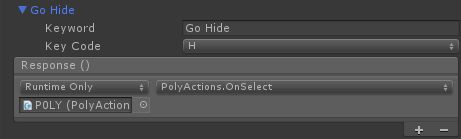
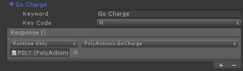
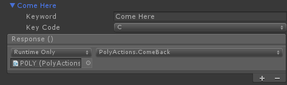
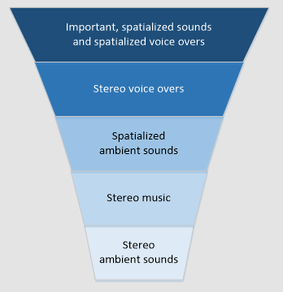
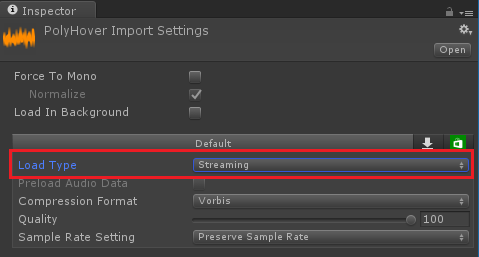
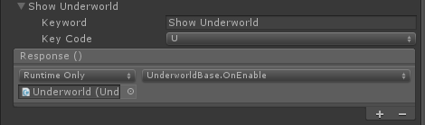
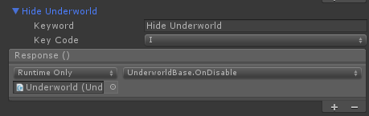

# ホログラム 220

[*空間音響*](https://developer.microsoft.com/ja-jp/windows/mixed-reality/spatial_sound)は、ホログラムに生命を吹き込み、仮想世界のホログラムに存在感を与えます。ホログラムは光と音で構成されます。そのため、ホログラムが視界から消えても、空間音響によってホログラムを見つけることができます。空間音響はラジオから聞こえる一般的な音とは違います。空間音響は、3D空間内に位置付けられる音です。空間音響により、ホログラムの音が背後、横、頭上から聞こえるように感じることができます。このチュートリアルでは、以下のことを学びます。

-   開発環境を構成して、Microsoft の空間音響を使用する。
-   空間音響を使って相互作用の質を高める。
-   空間音響と空間マッピングを連動させる。
-   音響の設計とミキシングのベスト プラクティスを理解する。
-   音響を使って特殊効果を高め、ユーザーを複合現実の世界に誘う。

## 前提条件

-   [*適切なツールをインストールして*](https://developer.microsoft.com/ja-jp/windows/mixed-reality/install_the_tools)構成した Windows 10 PC。
-   ある程度基本的な C\# プログラミング能力。
-   [*ホログラム101*](holograms_101.md) の修了。
-   [*開発用に構成した*](https://developer.microsoft.com/ja-jp/windows/mixed-reality/Using_Visual_Studio.html#enabling_developer_mode) HoloLens デバイス。

## プロジェクト ファイル

-   プロジェクトに必要な[*ファイル*](https://github.com/Microsoft/HolographicAcademy/archive/Holograms-220-SpatialSound.zip)はダウンロードします。Unity 5.5 が必要です。
    -   依然として Unity 5.4 のサポートが必要な場合は、[*こちらのリリース*](https://github.com/Microsoft/HolographicAcademy/archive/v1.5.4-220.zip)を使用してください。こちらのリリースは最新版ではなくなっている可能性があります。
-   デスクトップなどのアクセスしやすい場所にファイルを解凍します。

## 正誤表と注意事項

-   コードをブレークポイントで停止するには、\[ツール\] 、\[オプション\] 、\[デバッグ\] の順に選び、\[マイ コードのみ\] を無効にする (チェックボックスをオフにする) 必要があります。

## チュートリアルの内容

 -   [第 1 章 - Unity のセットアップ](holograms_220.md#第-1-章---unity-のセットアップ)
 -   [第 2 章 - 空間音響と相互作用](holograms_220.md#第-2-章---空間音響と相互作用)
     -   [2.1 現実感を高める](holograms_220.md#現実感を高める)
     -   [2.2 ユーザーの視線の向きを変える](holograms_220.md#ユーザーの視線の向きを変える)
     -   [2.3 ジェスチャーのフィードバック](holograms_220.md#ジェスチャーのフィードバック)
 -   [第 3 章 - 空間音響と空間マッピング](holograms_220.md#第-3-章---空間音響と空間マッピング)
     -   [3.1 現実世界の相互作用](holograms_220.md#現実世界の相互作用)
     -   [3.2 音響の遮蔽](holograms_220.md#音響の遮蔽)
     -   [3.3 室内モデル](holograms_220.md#室内モデル)
 -   [第 4 章 - 音響設計](holograms_220.md#第-4-章---音響設計)
     -   [4.1 音と体験の設計](holograms_220.md#音と体験の設計)
     -   [4.2 音響ミキシング](holograms_220.md#音響ミキシング)
     -   [4.3 パフォーマンス](holograms_220.md#パフォーマンス)
 -   [第 5 章 - 特殊効果](holograms_220.md#第-5-章---特殊効果)
     -   [5.1 魔法の窓](holograms_220.md#魔法の窓)
 -   [6 終わりに](holograms_220.md#終わりに)

## 第 1 章 - Unity のセットアップ

### 目標

-   Unity の音響構成を変更して、Microsoft 空間音響を使用する。
-   Unity で 3D 音響をオブジェクトに追加する。

### 手順

-   Unity を起動します。
-   \[Open\] を選びます。
-   最初に解凍したデスクトップのフォルダーに移動します。
-   Starting フォルダーをクリックし、\[Select Folder\] をクリックします。
-   プロジェクトが Unity に読み込まれるのを待ちます。
-   \[Project\] パネルで Scenes フォルダーの Decibel.unity を開きます。
-   \[Hierarchy\] パネルで \[HolographicCollection\] を展開して \[POLY\] を選びます。
-   \[Inspector\] パネルで \[AudioSource\] を展開すると、\[Spatialize\] チェックボックスがないのがわかります。

Unity では空間化プラグインが既定で読み込まれません。以下の手順に従って、プロジェクトで空間音響を有効にします。

-   Unity 上部のメニューで、\[Edit\] 、\[Project Settings\] 、\[Audio\] の順に移動します。
-   \[Spatializer Plugin\] ボックスの一覧で \[MS HRTF Spatializer\] を選びます。
-   \[Hierarchy\] パネルで \[HolographicCollection\] 、\[POLY\] の順に選びます。
-   \[Inspector\] パネルの \[Audio Source\] コンポーネントに移動します。
-   \[Spatialize\] チェック ボックスをオンにします。
-   \[Spatial Blend\] スライダーを \[3D\] までドラッグするか、エディット ボックスに「1」と入力します。

ここでプロジェクトを Unity でビルドし、ソリューションを Visual Studio で構成します。

-   Unity 上部のメニューで、\[File\] 、\[Build Settings\] の順に移動します。
-   \[Scenes In Build\] の一覧に \[Scenes/Decibel\] がない場合は、\[Add Open Scenes\] をクリックします。
-   \[Platform\] の一覧で \[Windows Store\] を選び、\[Switch Platform\] をクリックします。
-   \[SDK\] を \[Universal 10\] に設定します。
-   \[Build Type\] を \[D3D\] に設定します。
-   \[Unity C\# Projects\] チェックボックスをオンにして、IntelliSense を有効にします。
-   \[Build\] をクリックします。
-   表示されるダイアログ ボックスで、\[New Folder\] をクリックし、フォルダーに「App」という名前を付けます。
-   \[App\] フォルダーをシングル クリックします。
-   \[Select Folder\] をクリックします。  
Unity によってスクリプトのコンパイルと Visual Studio ソリューションの作成が開始されます。完了すると、エクスプローラーウィンドウが表示されます。
-   Visual Studio ウィンドウの上部で、ターゲットを \[Release\] と \[x86\] に変更します。
-   \[ローカル コンピューター\] の横にある小さな下矢印をクリックして、\[リモート コンピューター\] を選びます。
-   \[アドレス\] ボックスに [*HoloLens の IP アドレス*](https://developer.microsoft.com/ja-jp/windows/mixed-reality/Connecting_to_Wi-Fi_on_HoloLens.html#identifying_the_hololens_ip_address_on_the_wi-fi_network)を入力し、\[認証モード\] は \[ユニバーサル (暗号化されていないプロトコル)\] をそのまま使います。

## 第 2 章 - 空間音響と相互作用

### 目標

-   音を使ってホログラムの現実感を高める。
-   音を使ってユーザーの視線の向きを変える。
-   音を使ってジェスチャーのフィードバックを提供する。

### 現実感を高める

#### 主要概念

-   ホログラム音響を空間に広げる。
-   音源をホログラムの適切な場所に置く。

音が聞こえる適切な場所はホログラムによって異なります。たとえば、人間のホログラムだとしたら、足の近くではなく、口の近くに音源を置くことになります。

#### 手順

以下の手順では、空間音響をホログラムにアタッチします。

-   \[Hierarchy\] パネルで \[HolographicCollection\] を展開して \[POLY\] を選びます。
-   \[Inspector\] パネルの \[AudioSource\] で、\[AudioClip\] の横にある円をクリックし、ポップアップで \[PolyHover\] を選びます。
-   \[Output\] の横にある円をクリックし、ポップアップで \[SoundEffects\] を選びます。

プロジェクト「Decibel」では、Unity の AudioMixerコンポーネントを使って、音響をグループにして音量を調整できるようにしています。このように音響をグループにすることで、各音響の相対音量を維持しながら、全体音量を調整できるようになります。

-   \[AudioSource\] で \[3D Sound Settings\] を展開します。
-   \[Doppler Level\] に「0」を設定します。

ドップラーレベルにゼロを設定すると、(ホログラムまたはユーザーのいずれかの)動きが原因で絶対音程が変化することがなくなります。ドップラーの代表的な例が高速で移動する車両です。立ち止まっている聞き手に車両が近づくにつれ、エンジンの絶対音程は上がっていきます。聞き手の前を通り過ぎて遠ざかっていくと、その距離に合わせて絶対音程が下がっていきます。

### ユーザーの視線の向きを変える

#### 主要概念

-   音を使って重要なホログラムに注意を引き付ける。
-   耳の助けを借りて見るべき場所に目を向ける。
-   脳には学習した体験が蓄積される。

鳥は普通人間の頭上にいると考えるのは、学習によって得られる体験の一例です。鳥の鳴き声を耳にすると、人間はまず上を見ます。鳥を下に置いても、音のする方向に正しく顔を向けさせることはできますが、鳥の声がしたら見上げるべきだという体験に基づいてホログラムを見つけることはできません。

#### 手順

以下の手順では、POLYがユーザーの背後に隠れ、音を使ってホログラムを見つけられるようにします。

-   \[Hierarchy\] パネルで \[Managers\] を選びます。
-   \[Inspector\] パネルで \[Keyword Manager\] を展開します。
-   \[Keyword Manager\] で \[Keywords and Responses\] 、\[Go Hide\] の順に展開します。
-   \[No Function\] を \[PolyActions.OnSelect\] に変更します。

### ジェスチャーのフィードバック

#### 主要概念

-   ジェスチャーを明確に確認したことを音を使ってユーザーに伝える。
-   過度に大きな音を立ててユーザーを驚かさない。
-   体験していることを妨げない小さな音が大きな効果を発揮する。

#### 手順

-   \[Hierarchy\] パネルで \[HologramCollection\] を展開します。
-   \[EnergyHub\] を展開し、\[Base\] を選びます。
-   \[Inspector\] パネルで \[Add Component\] をクリックして \[Gesture Sound Handler\] を追加します。
-   \[Gesture Sound Handler\] で、\[Navigation Started Clip\] と \[Navigation Updated Clip\] の横にある円をクリックし、ポップアップで \[RotateClick\] を選びます。
-   \[Hierarchy\] パネルで \[Managers\] を選びます。
-   \[Inspector\] パネルで \[Add Component\] をクリックして \[Gesture Sound Manager\] を追加します。
-   \[GestureSoundManager\] をダブルクリックして Visual Studio で読み込みます。

Gesture Sound Manager は、以下の作業を実行します。

-   \[AudioSource\] を作成して構成します。
-   適切な GameObject がある場所にこの AudioSource を置きます。
-   ジェスチャーに関連付けられた AudioClip を再生します。

オーディオ クリップとジェスチャーの関連付けは、GestureSoundHandler.csで行っています。

### ビルドと配置

-   Unity で、\[File\] 、\[Build Settings\] の順に選びます。
-   App フォルダーを選びます。
-   \[Build\] をクリックします。
-   Unity を終了すると、エクスプローラー ウィンドウが表示されます。
-   Visual Studio に切り替えます。

ツール バーをチェックして、\[Release\] 、\[x86\] 、\[リモート デバイス\] が設定されているのを確認します。この設定になっていない場合、Visual Studio でコーディングを行っています。Appフォルダーのソリューションを開く必要があります。

-   確認されたら、プロジェクト ファイルを再度読み込みます。
-   **Decibel.sln** をダブルクリックして、Visual Studio で読み込みます。
-   上部ツール バーで、ターゲットを \[Release\] と \[x86\] に変更します。
-   \[デバッグ\] 、\[デバッグなしで開始\] の順に選ぶか、**Ctrl** キーを押しながら **F5** キーを押します。
-   **メモ:** Visual Studio の \[エラー\] パネルに、赤でエラーがいくつか表示されることがあります。これらのエラーは無視しても問題は生じません。\[出力\] パネルにエラーが表示される場合は解決する必要があります(エラーの原因はほぼスクリプト内でのミスによるものです)。

アプリを配置したら、以下を行います。

-   POLY の周りを動き、音の変化を観察します。
-   「Go Hide」と発話して、POLY を背後に移動させます。POLYを音で探します。
-   EnergyHub の Base に視線を送ります。ホログラムの左側か右側をタップしてドラッグし、ホログラムを回転します。ジェスチャーに応じてクリック音が変化するのがわかります。

メモ: 操作に追従するテキストパネルがあります。このパネルには、このコース全体で使える音声コマンドが含まれています。

## 第 3 章 - 空間音響と空間マッピング

### 目標

-   音を使ってホログラムと現実世界の相互作用を確認する。
-   現実世界を使って音を遮る。

### 現実世界の相互作用

#### 主要概念  

-   通常、現実の物体は、面や別の物体にぶつかると音を立てる。
-   音はこれまでの体験に合わせた適切なものにする。

たとえば、テーブルにカップを置く音は、金属片に大きな石を落した音よりも小さな音にします。

#### 手順  

-   \[Hierarchy\] パネルで \[HologramCollection\] を展開します。
-   \[EnergyHub\] を展開し、\[Base\] を選びます。
-   \[Inspector\] パネルで \[Add Component\] をクリックして \[Tap To Place\] を追加します。
-   \[Tap To Place\] で \[Placement Material\] の横にある円をクリックし、ポップアップで \[Wireframe\] を選びます。
-   \[Placement Sound\] に \[Place\] を設定します。
-   \[Pickup Sound\] に \[Pickup\] を設定します。

### 音響の遮蔽

#### 主要概念

-   光と同様、音は遮ることができる。

代表的な例はコンサートホールです。聞き手がホールの外に立ち、ドアが閉まっていれば、音楽ははっきり聞こえません。通常、音量も下がります。ドアが開くと、あらゆる音が実際の音量で聞こえます。
-   通常、高周波音は低周波音よりも多く吸収される。

#### 手順

-   \[Hierarchy\] パネルで \[HologramCollection\] を展開して \[POLY\] を選びます。
-   \[Inspector\] パネルで \[Add Component\] をクリックして \[Audio Emitter\] を追加します。

Audio Emitter クラスでは、以下の機能が提供されます。
-   AudioSource (音源) の音量に加えたすべての変更を元に戻します。
-   ユーザーの位置から AudioEmitter をアタッチする GameObject の方向に、Physics.RaycastNonAlloc を実行します。

RaycastNonAlloc メソッドはパフォーマンスの最適化に使用し、割り当て数と返される結果の数を制限します。

-   IAudioInfluencer を見つけるたびに、ApplyEffectメソッドを呼び出します。
-   前回の IAudioInfluencer が見つからなくなったら、RemoveEffect メソッドを呼び出します。

AudioEmitter は、フレーム単位に毎回更新されるのではなく、人間が感じる時間で更新されます。これは、普通人間の動きは遅く、4分の1 秒間隔や 2分の1 秒間隔といった高い頻度で効果を更新する必要がないためです。ある場所から別の場所に瞬間移動するホログラムは、錯覚を引き起こす可能性があります。

-   \[Hierarchy\] パネルで \[HologramCollection\] を展開します。
-   \[EnergyHub\] を展開し、\[BlobOutside\] を選びます。
-   \[Inspector\] パネルで \[Add Component\] をクリックして \[Audio Occluder\] を追加します。
-   \[Audio Occluder\] で \[Cutoff Frequency\] に「1500」を設定します。

この設定により、AudioSource (音源) の周波数を 1500 Hz 以下に制限します。
-   \[Volume Pass Through\] に「0.9」を設定します。

この設定により、AudioSource (音源) の音量を現在レベルの 90% に下げます。

Audio Occluder は IAudioInfluencer を実装して以下を行います。
-   AudioLowPassFilter を使って遮蔽効果を適用します。このフィルターは、AudioEmitter によって管理される AudioSource にアタッチされます。
-   AudioSource に音量減衰を適用します。
-   効果を無効にします。これは、ニュートラルな遮断周波数を設定しフィルターを無効にすることで行います。

ニュートラルな遮断周波数は 22 kHz (22,000 Hz) にしています。人間の耳に聞こえる名目最大周波数を上回り、音に顕著な影響を与えない周波数として、この値を選んでいます。
-   \[Hierarchy\] パネルで \[SpatialMapping\] を選びます。
-   \[Inspector\] パネルで \[Add Component\] をクリックして \[Audio Occluder\] を追加します。
-   \[Audio Occluder\] で \[Cutoff Frequency\] に「750」を設定します。

ユーザーと AudioEmitterの間に複数の遮蔽物がある場合、フィルターにこの最低周波数が適用されます。
-   \[Volume Pass Through\] に「0.75」を設定します。

ユーザーと AudioEmitter の間に複数の遮蔽物がある場合、この音量パススルーが追加適用されます。
-   \[Hierarchy\] パネルで \[Managers\] を選びます。
-   \[Inspector\] パネルで \[Keyword Manager\] を展開します。
-   \[Keyword Manager\] で \[Keywords and Responses\]  、\[Go Charge\] の順に展開します。
-   \[No Function\] を \[PolyActions.GoCharge\] に変更します。

-   \[Come Here\] を展開します。
-   \[No Function\] を \[PolyActions.ComeBack\] に変更します。

### ビルドと配置

-   これまでと同様、Unity でプロジェクトをビルドし、Visual Studio で配置します。

アプリを配置したら、以下を行います。

-   「Go Charge」と発話して、POLY を EnergyHub に入れます。

音の変化に注意します。はっきりとしない小さな音になります。ユーザーと EnergyHub の間に壁や他の物体があると、現実世界の遮蔽により、音がさらに小さくなるのがわかります。

-   「Come Here」と発話して、POLY を EnergyHub から出し、ユーザーの前に来るようにします。

POLY が EnergyHub から出ると、音を遮るものがなくなります。まだ遮られているように聞こえるのであれば、POLY は現実世界に遮られている可能性があります。POLY までの視線がクリアになるように、移動してみてください。

### 室内モデル

#### 主要概念

-   空間の大きさは、音の認知につながるサブリミナル キューを提供する。
-   **AudioSource** ごとに室内モデルを設定する。
-   [*HoloToolkit for Unity*](https://github.com/Microsoft/HoloToolkit-Unity)では、室内モデルを設定するコードを提供している。
-   複合現実体験では、現実の空間に最適な室内モデルを選ぶ。

仮想現実のシナリオを作成している場合は、仮想環境に最適な室内モデルを選びます。

## 第 4 章 - 音響設計

### 目標

-   効果的に音響を設計するための考慮事項を理解する。
-   ミキシングのテクニックとガイドラインを習得する。

### 音と体験の設計

ここでは、音と体験の設計に関する主な考慮事項とガイドラインを取り上げます。

#### すべての音を標準化する

各音に音量レベルを調整する特別なコードが必要になる事態は避けます。時間がかかり、音響ファイルの更新が難しくなります。

#### これまでの体験を反映するよう設計する

HoloLens は、完全組み込み型のホログラフィックコンピューターで、制約はありません。ユーザーは動きながら、そこに組み込んだ仮想体験を行います。オーディオミックスをテストする場合は、必ず動きながら確かめるようにします。

#### ホログラムの音は適切な場所から発する

現実の世界では、犬の吠え声はしっぽからは聞こえません。人間の声は足から聞こえません。ホログラムの予想外の場所から音が出る事態は避けます。  
小さなホログラムの場合、その形状の中心から音を発するのが妥当です。

#### 耳慣れた音が最も認知しやすい

人の声や音楽は、どこから聞こえてくるか簡単に認知できます。名前を呼ばれたら、その声がどこから、どのくらいの距離から聞こえたかがほぼ正確にわかります。逆に言えば、耳慣れない音を認知するのは困難です。

#### ユーザーの期待に応える

音がした場所を聞き分ける場合、それまでの生活体験が大きな役割を果たします。こうした生活体験から、人の声がどこから聞こえてくるかは簡単にわかります。音を発する場所を決めるときは、ユーザーの体験に裏付けられた期待に応えることが重要です。

たとえば、鳥のさえずりを耳にしたら人は上を見ます。鳥は視野の上にいる(飛んでいるか、木に止まっている)
のが普通です。ユーザーの目を音がした正しい方向に向けるのは難しくありませんが、視線の高さが違ってホログラムが見つからなければ、戸惑いや不満を感じます。

#### 見えない物体が音をたてないようにする

現実の世界で音が聞こえると、一般に、音を発している物体を見分けることができます。このことは体験からわかります。音が聞こえ、その場所がわかっているのに物体が見えなければ、非常に困惑します。

このガイドラインにはいくつか例外があります。たとえば、野外でのクリケットのような環境音は、目に見えなくてもかまいません。これまでの生活体験から、このような音の発生源が視野に入らないことに慣れています。

### 音響ミキシング

#### HoloLens のターゲットの音量を 70% にしてミキシングする

複合現実では、ホログラムを現実世界に表示して体感できるようにします。つまり、現実世界の音も聞こえます。ターゲットの音量を70%にすると、ユーザーは体感するホログラムの音と、ホログラムを取り巻く現実世界の音を聞きわけることができます。

#### HoloLens の音量を 100% にすると外部音が打ち消される

音量レベル 100%は、仮想現実体験と同じです。目にするものを別の世界に誘うのであれば、耳にするものも別の世界に誘います。

#### Unity の AudioMixer を使って音のカテゴリを調整する

ミキシングを設計するときは、音のカテゴリを作成し、各カテゴリの音量を 1つの単位として増減する機能を用意すると役に立つことがよくあります。これにより、ミキシング全体への変更を迅速かつ簡単に行えるだけでなく、各音の相対レベルを維持できます。一般的なカテゴリには、音響効果、環境音、ナレーション、バックグラウンドミュージックなどがあります。

#### ユーザーの視線を基に音をミキシングする

ユーザーが目を向けている場所を基に、体感する音響ミキシングを変化させると役立つことがよくあります。よく使われるテクニックの 1 つは、ホログラフィックフレームの外にあるホログラムの音量レベルを下げる方法です。これにより、ユーザーは目前の情報に注目しやすくなります。また、音量を上げることによって、重要な出来事に注意を引く方法もあります。

#### ミキシングを組み立てる

ミキシングを組み立てるときは、バックグラウンドオーディオから始め、重要度を基準に層を重ねていきます。通常、層を重ねるたびに、前の層よりも大きな音にします。ミキシングは逆三角形になっていると考えます。一番下を最も重要度の低い層(通常、最も小さな音)にし、以下の図のようにミキシングを組み立てていきます。

興味深いシナリオはナレーションです。作成しているホログラム体験に応じて、ステレオ(場所を特定しない)
音響を用意し、ナレーションを空間化することができます。マイクロソフトが公開している以下の 2 つのホログラム体験は、各シナリオの優れた例を示しています。

[*HoloTour*](http://www.microsoft.com/ja-jp/store/p/holotour/9nblggh5pj87)は、ステレオのナレーションを使っています。表示されている観光地をナレーターが説明するときは、音が一貫して聞こえ、ユーザーがどこにいても変わりません。これにより、ナレーターは、仮想環境での空間音響の効果を落とさずにシーンを説明できます。

[*Fragments*](https://www.microsoft.com/ja-jp/store/p/fragments/9nblggh5ggm8)では、空間化されたナレーションが探偵の役割を演じます。探偵の声を使って、実際の人間が部屋にいるかのように、重要なヒントにユーザーの注意が向けられます。これにより、優れた臨場感を実現しながら、ミステリーを解いていくことができます。

### パフォーマンス

#### CPU 使用率

空間音響を使っている場合、10 ～ 12 個のエミッターによって CPU の約 12%が消費されます。

#### 長いオーディオ ファイルはストリーミングする

特に標準サンプル レート (44.1 kHz や 48 kHz) では、オーディオデータが大きくなる場合があります。全般的な規則として、5 ～ 10秒を超えるオーディオファイルはストリーミングし、アプリのメモリ使用量を減らします。

Unity では、ファイルのインポート設定で、ストリーミングするオーディオファイルにマークを付けることができます。

## 第 5 章 - 特殊効果

### 目標

-   「魔法の窓」に深さを追加する。
-   ユーザーを仮想の世界に誘う。

### 魔法の窓

#### 主要概念

-   秘められた世界への入り口を作成し、人目を引き付ける。
-   ホログラムやユーザーが秘められた世界に近づくと、オーディオ効果を追加して現実感を高める。

#### 手順

-   \[Hierarchy\] パネルで \[HologramCollection\] を展開して \[Underworld\] を選びます。
-   \[Underworld)\] を展開し、\[VoiceSource\] を選びます。
-   \[Inspector\] パネルで \[Add Component\] をクリックして \[User Voice Effect\] を追加します。

AudioSource コンポーネントを VoiceSource に追加します。

-   \[AudioSource\] で \[Output\] (出力) に \[UserVoice (Mixer)\] 設定します。
-   \[Spatialize\] チェック ボックスをオンにします。
-   \[Spatial Blend\] スライダーを \[3D\] までドラッグするか、エディット ボックスに「1」と入力します。
-   \[3D Sound Settings\] を展開します。
-   \[Doppler Level\] に「0」を設定します。
-   \[User Voice Effect\] で \[Parent Object\] をシーンの \[Underworld\] に設定します。
-   \[Max Distance\] に「1」を設定します。

\[Max Distance\] を設定することにより、ユーザーが親オブジェクトにどの程度近づいたら User Voice Effect 効果を有効にするかを指示します。
-   \[User Voice Effect\] の \[Chorus Parameters\] を展開します。
-   \[Depth\] に「0.1」を設定します。
-   \[Tap 1 Volume\] 、\[Tap 2 Volume\] 、\[Tap 3 Volume\] に「0.8」を設定します。
-   \[Original Sound Volume\] に「0.5」を設定します。

上記の設定では、ユーザーの声に豊かさを加えるために使う Unity の \[AudioChorusFilter\] のパラメーターを構成します。

-   \[User Voice Effect\] の \[Echo Parameters\] を展開します。
-   \[Delay\] に「300」を設定します。
-   \[Decay Ratio\] に「0.2」を設定します。
-   \[Original Sound Volume\] に「0」を設定します。

上記の設定では、ユーザーの声をエコーさせるために使う Unity の \[AudioEchoFilter\] を構成します。

User Voice Effect スクリプトは、以下を行います。

-   ユーザーと、このスクリプトがアタッチされる GameObject との距離を計測します。
-   ユーザーが GameObject の方を向いているかどうかを判断します。

効果を有効にするには、距離に関係なく、ユーザーが GameObject
の方を向いている必要があります。

-   AudioChorusFilter と AudioEchoFilter を AudioSourceに適用して構成します。
-   フィルターを無効にすることによって、効果を無効にします。

User Voice Effect では、[*HoloToolkit for Unity*](https://github.com/Microsoft/HoloToolkit-Unity) の Mic Stream
Selector コンポーネントを使って、高い品質の声のストリームを選び、Unity のオーディオ システムにルーティングします。

-   \[Hierarchy\] パネルで \[Managers\] を選びます。
-   \[Inspector\] パネルで \[Keyword Manager\] を展開します。
-   \[Keyword Manager\] で \[Keywords and Responses\]  、\[Show Underworld\] の順に展開します。
-   \[No Function\] を \[UnderworldBase.OnEnable\] に変更します。

-   \[Hide Underworld\] を展開します。
-   \[No Function\] を \[UnderworldBase.OnDisable\] に変更します。

### ビルドと配置

-   これまでと同様、Unity でプロジェクトをビルドし、Visual Studioで配置します。

アプリを配置したら、以下を行います。

-   面 (壁、床、テーブル) に顔を向けて、「Show Underworld」と発話します。

闇の世界が表示され、他のホログラムはすべて非表示になります。闇の世界が表示されない場合は、現実世界で面に顔を向けていることを確認します。
-   闇の世界のホログラムの 1 メートル以内に近づき、話しかけます。その声にオーディオ効果が施されるようになります。
-   闇の世界に背を向けると、効果が適用されなくなるのがわかります。
-   闇の世界を非表示にするには、「Hide Underworld」と発話します。闇の世界が非表示になり、見えなくなっていたホログラムが再び表示されます。

## 終わりに

お疲れ様でした。これでチュートリアル「ホログラム 220 - 空間音響」は終わりです。

仮想世界の音に耳を傾けます。音によって仮想世界の体感に生命が吹き込まれます。
