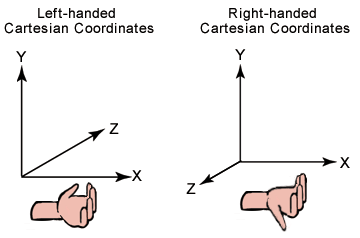

**DirectX における座標系**

[*座標系*](https://developer.microsoft.com/ja-jp/windows/holographic/coordinate_systems)は、Windows
Holographic API によって提供される空間認識の基礎を成します。

現在の座席型 VR デバイスや ワンルーム VR
デバイスは、デバイスの追跡空間を表現するために 1
つの主要座標系を定めます。HoloLens
デバイスは大きな不明確な環境で使用し、ユーザーが歩き回るにつれて周囲を認識して学習するよう設計されています。これにより、デバイスはユーザーがいる部屋についての知識を改善しながら継続的に適応していくことができますが、座標系はアプリの有効期間の中で相互に関係を変えていくことになります。

**目次**

-   [*1 Windows
    の空間座標系*](https://developer.microsoft.com/ja-jp/windows/holographic/coordinate_systems_in_directx#spatial_coordinate_systems_in_windows)

-   [*2
    仮想世界での静止座標系を使用したホログラムの配置*](https://developer.microsoft.com/ja-jp/windows/holographic/coordinate_systems_in_directx#place_holograms_in_the_world_using_a_stationary_frame_of_reference)

-   [*3
    仮想世界での空間アンカーを使用したホログラムの配置*](https://developer.microsoft.com/ja-jp/windows/holographic/coordinate_systems_in_directx#place_holograms_in_the_world_using_spatial_anchors)

    -   [*3.1 ホログラフィック
        コンテンツ用空間アンカーの作成*](https://developer.microsoft.com/ja-jp/windows/holographic/coordinate_systems_in_directx#create_spatialanchors_for_holographic_content)

    -   [*3.2 SpatialAnchorStore
        の非同期読み込みとキャッシュ*](https://developer.microsoft.com/ja-jp/windows/holographic/coordinate_systems_in_directx#asynchronously_load.2C_and_cache.2C_the_spatialanchorstore)

    -   [*3.3 アンカー
        ストアへのコンテンツの保存*](https://developer.microsoft.com/ja-jp/windows/holographic/coordinate_systems_in_directx#save_content_to_the_anchor_store)

    -   [*3.4 アプリ再開時のアンカー
        ストアからのコンテンツの読み込み*](https://developer.microsoft.com/ja-jp/windows/holographic/coordinate_systems_in_directx#load_content_from_the_anchor_store_when_the_app_resumes)

    -   [*3.5 必要に応じたアンカー
        ストアのクリア*](https://developer.microsoft.com/ja-jp/windows/holographic/coordinate_systems_in_directx#clear_the_anchor_store.2C_when_needed)

    -   [*3.6 例:
        アンカー座標系と静止座標系との関連付け*](https://developer.microsoft.com/ja-jp/windows/holographic/coordinate_systems_in_directx#example:_relating_anchor_coordinate_systems_to_stationary_reference_frame_coordinate_systems)

-   [*4
    デバイスの従属座標系を使用するホログラムの作成*](https://developer.microsoft.com/ja-jp/windows/holographic/coordinate_systems_in_directx#create_holograms_using_a_device-attached_frame_of_reference)

    -   [*4.1
        デバイスに従属する座標系の使用*](https://developer.microsoft.com/ja-jp/windows/holographic/coordinate_systems_in_directx#use_a_reference_frame_attached_to_the_device)

    -   [*4.2 空間ポインター
        ポーズの取得と、ユーザーの視線への追従*](https://developer.microsoft.com/ja-jp/windows/holographic/coordinate_systems_in_directx#get_a_spatial_pointer_pose.2C_and_follow_the_user.27s_gaze)

    -   [*4.3
        カメラに合わせたホログラムの回転*](https://developer.microsoft.com/ja-jp/windows/holographic/coordinate_systems_in_directx#rotate_the_hologram_to_face_the_camera)

    -   [*4.4 画像安定のためのフォーカス
        ポイントの設定*](https://developer.microsoft.com/ja-jp/windows/holographic/coordinate_systems_in_directx#set_the_focus_point_for_image_stabilization)

    -   [*4.5
        従属ホログラムのレンダリング*](https://developer.microsoft.com/ja-jp/windows/holographic/coordinate_systems_in_directx#render_the_attached_hologram)

-   [*5
    追跡喪失への対処*](https://developer.microsoft.com/ja-jp/windows/holographic/coordinate_systems_in_directx#handling_tracking_loss)

-   [*6
    空間マッピング*](https://developer.microsoft.com/ja-jp/windows/holographic/coordinate_systems_in_directx#spatial_mapping)

-   [*7
    関連項目*](https://developer.microsoft.com/ja-jp/windows/holographic/coordinate_systems_in_directx#see_also)

**Windows の空間座標系 **

Windows で現実世界の座標系を論理的に定める核となる型が
[*SpatialCoordinateSystem*](https://msdn.microsoft.com/ja-jp/library/windows/apps/windows.perception.spatial.spatialcoordinatesystem.aspx)
です。この型のインスタンスが任意の座標系を表し、それぞれの詳細が分からなくても
2
つの座標系間での変換に使用できる変換行列を取得するメソッドを提供します。

空間情報 (ユーザーを取り巻く点、光線、音量などを表現)
を返すメソッドは、SpatialCoordinateSystem
パラメーターを受け取り、ユーザーにとって最も有益な座標を返す座標系を決定します。返される座標は、常にメートル単位です。

SpatialCoordinateSystem
は、デバイスの位置を表す座標系など、他の座標系と動的関係を保持しています。どこかの時点で、デバイスはある座標系に落ち着き、他の座標系を使用しなくなります。ほとんどの座標系では、座標系が落ち着くまでの期間をアプリで対処する必要があります。

アプリでは SpatialCoordinateSystem
を直接作成しません。SpatialCoordinateSystem は Perception API
経由で利用します。Perception API の座標系には 3
つの主なソースがあります。この 3
つのソースはそれぞれ、「[*座標系*](https://developer.microsoft.com/ja-jp/windows/holographic/coordinate_systems)」で説明する以下の考え方に対応しています。

-   静止座標系を取得するには、*[SpatialStationaryFrameOfReference](https://msdn.microsoft.com/ja-jp/library/windows/apps/windows.perception.spatial.spatialstationaryframeofreference.aspx)*
    を作成します。

-   空間アンカーを取得するには、[*SpatialAnchor*](https://msdn.microsoft.com/ja-jp/library/windows/apps/windows.perception.spatial.spatialanchor.aspx)
    を作成します。

-   従属座標系を取得するには、[*SpatialLocatorAttachedFrameOfReference*](https://msdn.microsoft.com/ja-jp/library/windows/apps/windows.perception.spatial.spatiallocatorattachedframeofreference.aspx)
    を作成します。

これらのオブジェクトによって返されるすべての座標系は、y
軸は上方向が正、x 軸は右方向が正、z 軸は手前方向が正の右手系です。z
軸のどちらが正方向になるかを覚えるには、左手または右手の指を x
軸の正方向に向け、その指を y
軸の正方向に曲げます。このとき、親指は右手を使うか左手を使うかによって手前方向または画面奥の方向を指します。この親指が指す方向が
z 軸の正方向です。次の図はこの 2 つの座標系を示します。

デバイスの位置を基に SpatialCoordinateSystem
にブートストラップするには、以下で説明するように
[*SpatialLocator*](https://msdn.microsoft.com/ja-jp/library/windows/apps/windows.perception.spatial.spatiallocator.aspx)
クラスを使用して従属座標系または静止座標系のいずれかを作成します。

**仮想世界での静止座標系を使用したホログラムの配置 **

[*SpatialStationaryFrameOfReference*](https://msdn.microsoft.com/ja-jp/library/windows/apps/windows.perception.spatial.spatialstationaryframeofreference.aspx)
クラスは、ユーザーが動き回ってもユーザーを取り巻く世界と相対に[*静止した状態を保つ*](https://developer.microsoft.com/ja-jp/windows/holographic/Coordinate_systems.html#stationary_frame_of_reference)座標系を表します。この座標系はデバイス近くの座標を安定した状態に保つことを優先します。SpatialStationaryFrameOfReference
の主な使い方の 1 つは、ホログラムのレンダリング時にレンダリング
エンジン内で基盤となるワールド座標系として機能することです。

SpatialStationaryFrameOfReference
を取得するには、[*SpatialLocator*](https://msdn.microsoft.com/ja-jp/library/windows/apps/windows.perception.spatial.spatiallocator.aspx)
クラスを使用し、さらに
[*CreateStationaryFrameOfReferenceAtCurrentLocation*](https://msdn.microsoft.com/ja-jp/library/windows/apps/windows.perception.spatial.spatiallocator.createstationaryframeofreferenceatcurrentlocation.aspx)
を呼び出します。

以下は Visual Studio テンプレート コードです。

// The simplest way to render world-locked holograms is to create a
stationary reference frame

// when the app is launched. This is roughly analogous to creating a
"world" coordinate system

// with the origin placed at the device's position as the app is
launched.

referenceFrame =
locator.CreateStationaryFrameOfReferenceAtCurrentLocation();

-   静止座標系は空間全体と相対に最適な位置を示すよう設計されています。座標系内の個別の位置はわずかなずれが許容されます。これは、デバイスが環境について学習するため、正常な動作です。

-   個々のホログラムを正確に配置する必要があるときは、SpatialAnchor
    を使用して、現実世界の位置 (ユーザーが特別に関心を持つ点など)
    に個々のホログラムをアンカーで固定します。アンカーの位置はずれませんが、修正することは可能です。アンカーは修正が行われた後、次のフレームの開始時に修正された位置を使用します。

**仮想世界での空間アンカーを使用したホログラムの配置 **

[*空間アンカー*](https://developer.microsoft.com/ja-jp/windows/holographic/Coordinate_systems.html#spatial_anchors)とは、現実世界の特定の場所にホログラムを置くための優れた方法で、アンカーは時間がたっても座標系によって同じ位置が保たれます。ここでは、アンカーを作成して使用する方法とアンカー
データのしくみについて説明します。

SpatialAnchor は、選択した SpatialCoordinateSystem
内に任意の位置と向きで作成できます。デバイスは、その時点でその座標系に配置できる必要があります。また、その座標系は空間アンカーの限界に達してはいけません。

SpatialAnchor
の座標系を定義した後は、最初に空間アンカーを配置した正確な位置と向きを維持するために、その座標系が絶えず調整を行います。この
SpatialAnchor
を使って、ユーザーを取り巻く世界に固定され、正確な位置に現れるホログラムをレンダリングできます。

アンカーからの距離が離れるにつれて、アンカーの適切な位置に保持する調整の影響が大きくなります。そのため、空間アンカーの原点から約
3
メートル以上離れたコンテンツをアンカー相対にレンダリングするのは避けます。

SpatialAnchor を
[*SpatialAnchorStore*](https://msdn.microsoft.com/ja-jp/library/windows/apps/windows.perception.spatial.spatialanchorstore.aspx)
クラスを使用して保存し、その後のアプリ
セッションで利用することができます。

[*CoordinateSystem*](https://msdn.microsoft.com/ja-jp/library/windows/apps/windows.perception.spatial.spatialanchor.coordinatesystem.aspx)
プロパティによって、アンカー相対にコンテンツを配置できる座標系が提供されます。コンテンツを配置する際には、デバイスがアンカーの正確な位置を調整するときに適用するゆとりが設けられます。

こうした調整を開発者自身で管理するには、[*RawCoordinateSystem*](https://msdn.microsoft.com/ja-jp/library/windows/apps/windows.perception.spatial.spatialanchor.rawcoordinatesystem.aspx)
プロパティと、対応する
[*RawCoordinateSystemAdjusted*](https://msdn.microsoft.com/ja-jp/library/windows/apps/windows.perception.spatial.spatialanchor.rawcoordinatesystemadjusted.aspx)
イベントを使用します。

**ホログラフィック コンテンツ用空間アンカーの作成**

ここで示すコード サンプルでは、Windows Holographic アプリ
テンプレートを変更して、「**押す**」というジェスチャーが検出されたときのアンカーを作成します。その後、レンダリング中にそのアンカーにキューブを配置します。

ヘルパー クラスでは複数のアンカーをサポートしているので、このコード
サンプルを使用していくつでもキューブを配置できます。

アプリではアンカーの ID
を使ってアンカーを管理します。今回の例では、アプリのアンカー
コレクションに現在保存されているアンカーの番号を基に、シーケンシャルに名前を付ける方法を採用しています。

// Check for new input state since the last frame.

SpatialInteractionSourceState\^ pointerState =
m\_spatialInputHandler-&gt;CheckForInput();

if (pointerState != nullptr)

{

// Try to get the pointer pose relative to the
SpatialStationaryReferenceFrame.

SpatialPointerPose\^ pointerPose =
pointerState-&gt;TryGetPointerPose(currentCoordinateSystem);

if (pointerPose != nullptr)

{

// When a Pressed gesture is detected, the anchor will be created two
meters in front of the user.

// Get the gaze direction relative to the given coordinate system.

const float3 headPosition = pointerPose-&gt;Head-&gt;Position;

const float3 headDirection = pointerPose-&gt;Head-&gt;ForwardDirection;

// The anchor position in the StationaryReferenceFrame.

static const float distanceFromUser = 2.0f; // meters

const float3 gazeAtTwoMeters = headPosition + (distanceFromUser \*
headDirection);

// Create the anchor at position.

SpatialAnchor\^ anchor =
SpatialAnchor::TryCreateRelativeTo(currentCoordinateSystem,
gazeAtTwoMeters);

if ((anchor != nullptr) && (m\_spatialAnchorHelper != nullptr))

{

// In this example, we store the anchor in an IMap.

auto anchorMap = m\_spatialAnchorHelper-&gt;GetAnchorMap();

// Create an identifier for the anchor.

String\^ id = ref new
String(L"HolographicSpatialAnchorStoreSample\_Anchor") +
anchorMap-&gt;Size;

anchorMap-&gt;Insert(id-&gt;ToString(), anchor);

}

}

}

**SpatialAnchorStore の非同期読み込みとキャッシュ **

ここでは、SampleSpatialAnchorHelper
クラスの作成方法を取り上げます。このクラスは以下のような保存に対応します。

-   インメモリ アンカーのコレクションを Platform::String
    キーでインデックスを付けて保存します。

&nbsp;
-   座標系の SpatialAnchorStore
    からアンカーを読込みます。SpatialAnchorStore は、ローカル インメモリ
    コレクションとは別に管理されます。

&nbsp;
-   アプリの選択に応じて、ローカル インメモリ コレクションを
    SpatialAnchorStore に保存します。

以下に
[*SpatialAnchor*](https://msdn.microsoft.com/ja-jp/library/windows/apps/windows.perception.spatial.spatialanchor.aspx)
オブジェクトを
[*SpatialAnchorStore*](https://msdn.microsoft.com/ja-jp/library/windows/apps/windows.perception.spatial.spatialanchorstore.aspx)
に保存する方法を示します。

クラスの開始時に、SpatialAnchorStore を非同期で要求します。これには、API
がアンカー ストアを読み込む際にシステム I/O が関係します。この API
を非同期にして、I/O が非ブロッキングになるようにします。

// Request the spatial anchor store, which is the WinRT object that will
accept the imported anchor data.

return create\_task(SpatialAnchorManager::RequestStoreAsync())

.then(\[\](task&lt;SpatialAnchorStore\^&gt; previousTask)

{

std::shared\_ptr&lt;SampleSpatialAnchorHelper&gt; newHelper = nullptr;

try

{

SpatialAnchorStore\^ anchorStore = previousTask.get();

// Once the SpatialAnchorStore has been loaded by the system, we can
create our helper class.

// Using "new" to access private constructor

newHelper = std::shared\_ptr&lt;SampleSpatialAnchorHelper&gt;(new
SampleSpatialAnchorHelper(anchorStore));

// Now we can load anchors from the store.

newHelper-&gt;LoadFromAnchorStore();

}

catch (Exception\^ exception)

{

PrintWstringToDebugConsole(

std::wstring(L"Exception while loading the anchor store: ") +

exception-&gt;Message-&gt;Data() +

L"\\n"

);

}

// Return the initialized class instance.

return newHelper;

});

アンカーを保存するために使用できる SpatialAnchorStore
が用意されます。これは IMapView で、文字列のキー値が SpatialAnchor
のデータ値に関連付けられます。サンプル コードでは、これをプライベート
クラスのメンバー変数に格納しています。この変数には、ヘルパー
クラスのパブリック関数を使用してアクセスします。

SampleSpatialAnchorHelper::SampleSpatialAnchorHelper(SpatialAnchorStore\^
anchorStore)

{

m\_anchorStore = anchorStore;

m\_anchorMap = ref new Platform::Collections::Map&lt;String\^,
SpatialAnchor\^&gt;();

}

**メモ:** アンカー
ストアに対して保存と読み込みを行うには、忘れずに中断/再開のイベントにフックします。

void HolographicSpatialAnchorStoreSampleMain::SaveAppState()

{

// For example, store information in the SpatialAnchorStore.

if (m\_spatialAnchorHelper != nullptr)

{

m\_spatialAnchorHelper-&gt;TrySaveToAnchorStore();

}

}

void HolographicSpatialAnchorStoreSampleMain::LoadAppState()

{

// For example, load information from the SpatialAnchorStore.

LoadAnchorStore();

}

**アンカー ストアへのコンテンツの保存 **

システムによってアプリが中断するときは、空間アンカーをアンカー
ストアに保存する必要があります。アプリの実装での必要に応じ、任意の時点でアンカーをアンカー
ストアに保存することもできます。

インメモリ アンカーを SpatialAnchorStore
に保存する準備ができたら、コレクション全体をループして各アンカーを保存します。

// TrySaveToAnchorStore: Stores all anchors from memory into the app's
anchor store.

//

// For each anchor in memory, this function tries to store it in the
app's AnchorStore. The operation will fail if

// the anchor store already has an anchor by that name.

//

bool SampleSpatialAnchorHelper::TrySaveToAnchorStore()

{

// This function returns true if all the anchors in the in-memory
collection are saved to the anchor

// store. If zero anchors are in the in-memory collection, we will still
return true because the

// condition has been met.

bool success = true;

// If access is denied, 'anchorStore' will not be obtained.

if (m\_anchorStore != nullptr)

{

for each (auto& pair in m\_anchorMap)

{

auto const& id = pair-&gt;Key;

auto const& anchor = pair-&gt;Value;

// Try to save the anchors.

if (!m\_anchorStore-&gt;TrySave(id, anchor))

{

// This may indicate the anchor ID is taken, or the anchor limit is
reached for the app.

success=false;

}

}

}

return success;

}

**アプリ再開時のアンカー ストアからのコンテンツの読み込み **

アプリ再開時またはアプリ実装の必要に応じた任意の時点で、アンカー
ストアの IMapView から SpatialAnchor の独自のインメモリ
データベースにアンカーを移すことにより AnchorStore
に以前保存していたアンカーを復元できます。

SpatialAnchorStore
からアンカーを復元するには、対象のアンカーを独自のインメモリ
コレクションに復元します。

SpatialAnchor の独自のインメモリ
データベースが必要な場合があります。また、作成する SpatialAnchor
を文字列と関連付けるなんらかの方法が必要な場合もあります。サンプル
コードでは、アンカーの保存に Windows::Foundation::Collections::Imap
を選択しています。これにより、SpatialAnchorStore
に同じキーとデータ値を使用しやすくなります｡

// This is an in-memory anchor list that is separate from the anchor
store.

// These anchors may be used, reasoned about, and so on before
committing the collection to the store.

Windows::Foundation::Collections::IMap&lt;Platform::String\^,
Windows::Perception::Spatial::SpatialAnchor\^&gt;\^ m\_anchorMap;

**メモ:**
復元するアンカーが、すぐに見つからないことがあります。たとえば、アンカーが別の部屋や、まったく別の建物にあるかもしれません。AnchorStore
から取得するアンカーは、使用する前に検索の可能性をテストします。

今回のサンプル コードでは、AnchorStore
からすべてのアンカーを取得しています。これは必須要件ではありません。開発するアプリでは、実装にとって意味のある文字列キー値を使用して、アンカーの特定のサブセットを選択して取得する方が適切かもしれません。

// LoadFromAnchorStore: Loads all anchors from the app's anchor store
into memory.

//

// The anchors are stored in memory using an IMap, which stores anchors
using a string identifier. Any string can be used as

// the identifier; it can have meaning to the app, such as
"Game\_Leve1\_CouchAnchor," or it can be a GUID that is generated

// by the app.

//

void SampleSpatialAnchorHelper::LoadFromAnchorStore()

{

// If access is denied, 'anchorStore' will not be obtained.

if (m\_anchorStore != nullptr)

{

// Get all saved anchors.

auto anchorMapView = m\_anchorStore-&gt;GetAllSavedAnchors();

for each (auto const& pair in anchorMapView)

{

auto const& id = pair-&gt;Key;

auto const& anchor = pair-&gt;Value;

m\_anchorMap-&gt;Insert(id, anchor);

}

}

}

**必要に応じたアンカー ストアのクリア**

アプリの状態をクリアして新しいデータを書き込む必要がある場合があります。ここでは、そのために
[*SpatialAnchorStore*](https://msdn.microsoft.com/ja-jp/library/windows/apps/windows.perception.spatial.spatialanchorstore.aspx)
を使用する方法を示します。

今回のヘルパー クラスを使うと、Clear
関数をラップする必要がほぼなくなります。サンプル実装でこの方法を選択したのは、今回のヘルパー
クラスに SpatialAnchorStore
インスタンスを所有する役割を与えているためです。

// ClearAnchorStore: Clears the AnchorStore for the app.

//

// This function clears the AnchorStore. It has no effect on the anchors
stored in memory.

//

void SampleSpatialAnchorHelper::ClearAnchorStore()

{

// If access is denied, 'anchorStore' will not be obtained.

if (m\_anchorStore != nullptr)

{

// Clear all anchors from the store.

m\_anchorStore-&gt;Clear();

}

}

**例: アンカー座標系と静止座標系との関連付け **

アンカーが 1
つあり、そのアンカーの座標系のコンテンツを、既に他の大半のコンテンツに使用している
SpatialStationaryReferenceFrame
に関連付けるとします。アンカーの座標系から静止座標系への変換を取得するには、[*TryGetTransformTo*](https://msdn.microsoft.com/ja-jp/library/windows/apps/windows.perception.spatial.spatialcoordinatesystem.trygettransformto.aspx)
を使用します。

// In this code snippet, someAnchor is a SpatialAnchor\^ that has been
initialized and is valid in the current environment.

float4x4 anchorSpaceToCurrentCoordinateSystem;

SpatialCoordinateSystem\^ anchorSpace = someAnchor-&gt;CoordinateSystem;

const auto tryTransform =
anchorSpace-&gt;TryGetTransformTo(currentCoordinateSystem);

if (tryTransform != nullptr)

{

anchorSpaceToCurrentCoordinateSystem = tryTransform-&gt;Value;

}

このプロセスは 以下の 2 つの方法に有効です。

1.  2 つの座標系が相互の相対関係を認識できるかどうかがわかります。

2.  認識できる場合は、一方の座標系から他方の座標系への直接変換を取得できます。

この情報により、2 つの座標系のオブジェクト間の空間関係が認識されます。

レンダリングの場合は、通常、元の座標系やアンカーに応じてオブジェクトをグループ化する方が適切な結果が得られる可能性が高くなります。このグループごとに独立した描画処理を実行します。同じ座標系を使って最初に作成したモデル変換により、オブジェクトのビューのマトリックスがより正確になります。

**デバイスの従属座標系を使用するホログラムの作成**

デバイスの場所に[*固定される*](https://developer.microsoft.com/ja-jp/windows/holographic/Coordinate_systems.html#attached_frame_of_reference)ホログラムをレンダリングしたい場合があります。たとえば、デバイスの向きだけは判断できても空間内でのデバイスの位置が分からない場合に、デバッグ情報や情報メッセージを含むパネルをレンダリングするような場合です。そのためには、従属座標系を使用します。

SpatialLocatorAttachedFrameOfReference
クラスは、現実世界ではなく、デバイス相対の座標系を定義します。この座標系では、ユーザーの周囲に相対で頭部が固定され、座標系の作成時にユーザーが向いている方向を指します。それ以降、ユーザーがデバイスを回転させても、この座標系のすべての幾何学的配置はこの固定された頭部に相対になります。

HoloLens
の場合、この座標系の原点は、その位置が頭の回転に影響されないように、ユーザーの頭部の中心になります。アプリでは、ホログラムをユーザーの前に位置付ける際に、その位置からの相対オフセットを指定できます。

SpatialLocatorAttachedFrameOfReference を取得するには、SpatialLocator
クラスを使用し、さらに CreateAttachedFrameOfReferenceAtCurrentHeading
を呼び出します。

**デバイスに従属する座標系の使用**

ここでは、この API を使用してデバイスの従属座標系を有効にするための
Windows Holographic アプリ
テンプレートの変更について取り上げます。この「従属」ホログラムは、動かないホログラムやアンカーで固定されたホログラムと共に機能します。また、デバイスが仮想世界の中で位置を一時的に見つけられない場合にも使用できます。

まず、SpatialStationaryFrameOfReference の代わりに
SpatialLocatorAttachedFrameOfReference
を格納するようにテンプレートを変更します。

HolographicTagAlongSampleMain.h での変更

// A reference frame attached to the holographic camera.

Windows::Perception::Spatial::SpatialLocatorAttachedFrameOfReference\^
m\_referenceFrame;

HolographicTagAlongSampleMain.cpp での変更

// In this example, we create a reference frame attached to the device.

m\_referenceFrame =
m\_locator-&gt;CreateAttachedFrameOfReferenceAtCurrentHeading();

更新中、座標系の予測によって得られるタイムスタンプからこの座標系を取得するようになります。

// Next, we get a coordinate system from the attached frame of reference
that is

// associated with the current frame. Later, this coordinate system is
used for

// for creating the stereo view matrices when rendering the sample
content.

SpatialCoordinateSystem\^ currentCoordinateSystem =

m\_referenceFrame-&gt;GetStationaryCoordinateSystemAtTimestamp(prediction-&gt;Timestamp);

**空間ポインター ポーズの取得と、ユーザーの視線への追従**

今回のサンプル
ホログラムをユーザーの[*視線*](https://developer.microsoft.com/ja-jp/windows/holographic/gaze)に追従させます。これは
Holographic Shell
がユーザーの視線に追従するのと同じです。このためには、同じタイム
スタンプで SpatialPointerPose を取得する必要があります。

SpatialPointerPose\^ pose =
SpatialPointerPose::TryGetAtTimestamp(currentCoordinateSystem,
prediction-&gt;Timestamp);

この SpatialPointerPose
に、[*ユーザー頭部の現在位置*](https://developer.microsoft.com/ja-jp/windows/holographic/gaze_and_gestures_in_directx)に応じてホログラムの位置を決めるのに必要な情報が含まれています。

ユーザーが快適に感じるように、線形補間 ("lerp")
を使用して、一定期間に起きる位置の変化を滑らかにします。ホログラムを視線に固定するよりも、こちらの方がユーザーはより快適に感じます。追従するホログラムの位置を線形補間することで、動きを抑制してホログラムを安定させることもできます。このような抑制を行わないと､ユーザーの頭が少しでも動いたと判断されるとホログラムがぶれて見えることになります。

StationaryQuadRenderer::PositionHologram での変更

const float& dtime =
static\_cast&lt;float&gt;(timer.GetElapsedSeconds());

if (pointerPose != nullptr)

{

// Get the gaze direction relative to the given coordinate system.

const float3 headPosition = pointerPose-&gt;Head-&gt;Position;

const float3 headDirection = pointerPose-&gt;Head-&gt;ForwardDirection;

// The tag-along hologram follows a point 2.0m in front of the user's
gaze direction.

static const float distanceFromUser = 2.0f; // meters

const float3 gazeAtTwoMeters = headPosition + (distanceFromUser \*
headDirection);

// Lerp the position, to keep the hologram comfortably stable.

auto lerpedPosition = lerp(m\_position, gazeAtTwoMeters, dtime \*
c\_lerpRate);

// This will be used as the translation component of the hologram's

// model transform.

SetPosition(lerpedPosition);

}

**メモ:** デバック
パネルの場合、ユーザーの視界を妨げないように、少し脇の位置にホログラムを移動することがあります。以下に、その方法の例を示します。

StationaryQuadRenderer::PositionHologram での変更

// If you're making a debug view, you might not want the tag-along to be
directly in the

// center of your field of view. Use this code to position the hologram
to the right of

// the user's gaze direction.

/\*

const float3 offset = float3(0.13f, 0.0f, 0.f);

static const float distanceFromUser = 2.2f; // meters

const float3 gazeAtTwoMeters = headPosition + (distanceFromUser \*
(headDirection + offset));

\*/

**カメラに合わせたホログラムの回転**

単にホログラムの位置を決めるだけでは十分ではありません。ここでは 4
つのことを決めます。つまり、ユーザーに向き合うように対象物を回転することも必要です。この種のビルボード処理により、ホログラムをユーザー環境の一部に留めることができるため、この回転は仮想空間で行います。表示空間でのビルボード処理では、ホログラムがディスプレイの向きに固定されるため、快適には感じられません。この場合、表示空間のビルボード処理で立体的なレンダリングを妨げないような変換を取得するために、ビューの左右のマトリックスの間での内挿も必要になります。ここでは、ユーザーを向くように
X 軸と Z 軸を中止に回転します。

StationaryQuadRenderer::Update での変更

// Seconds elapsed since previous frame.

const float& dTime =
static\_cast&lt;float&gt;(timer.GetElapsedSeconds());

// Create a direction normal from the hologram's position to the origin
of person space.

// This is the z-axis rotation.

XMVECTOR facingNormal = XMVector3Normalize(-XMLoadFloat3(&m\_position));

// Rotate the x-axis around the y-axis.

// This is a 90-degree angle from the normal, in the xz-plane.

// This is the x-axis rotation.

XMVECTOR xAxisRotation =
XMVector3Normalize(XMVectorSet(XMVectorGetZ(facingNormal), 0.f,
-XMVectorGetX(facingNormal), 0.f));

// Create a third normal to satisfy the conditions of a rotation matrix.

// The cross product of the other two normals is at a 90-degree angle to

// both normals. (Normalize the cross product to avoid floating-point
math

// errors.)

// Note how the cross product will never be a zero-matrix because the
two normals

// are always at a 90-degree angle from one another.

XMVECTOR yAxisRotation = XMVector3Normalize(XMVector3Cross(facingNormal,
xAxisRotation));

// Construct the 4x4 rotation matrix.

// Rotate the quad to face the user.

XMMATRIX rotationMatrix = XMMATRIX(

xAxisRotation,

yAxisRotation,

facingNormal,

XMVectorSet(0.f, 0.f, 0.f, 1.f)

);

// Position the quad.

const XMMATRIX modelTranslation =
XMMatrixTranslationFromVector(XMLoadFloat3(&m\_position));

// The view and projection matrices are provided by the system; they are
associated

// with holographic cameras, and updated on a per-camera basis.

// Here, we provide the model transform for the sample hologram. The
model transform

// matrix is transposed to prepare it for the shader.

XMStoreFloat4x4(&m\_modelConstantBufferData.model,
XMMatrixTranspose(rotationMatrix \* modelTranslation));

**画像安定のためのフォーカス ポイントの設定**

[*画像を安定させる*](https://developer.microsoft.com/ja-jp/windows/holographic/Hologram_stability.html#stabilization_plane)ためにフォーカス
ポイントも設定します。追従ホログラムで最適な結果を得るには、ホログラムの速度を使う必要があります。速度は次のように計算します。

StationaryQuadRenderer::Update での変更

// Determine velocity.

// Even though the motion is spherical, the velocity is still linear

// for image stabilization.

auto& deltaX = m\_position - m\_lastPosition; // meters

m\_velocity = deltaX / dTime; // meters per second

HolographicTagAlongSampleMain::Update での変更

// SetFocusPoint informs the system about a specific point in your scene
to

// prioritize for image stabilization. The focus point is set
independently

// for each holographic camera.

// In this example, we set position, normal, and velocity for a
tag-along quad.

float3& focusPointPosition =
m\_stationaryQuadRenderer-&gt;GetPosition();

float3 focusPointNormal = -normalize(focusPointPosition);

float3& focusPointVelocity =
m\_stationaryQuadRenderer-&gt;GetVelocity();

renderingParameters-&gt;SetFocusPoint(

currentCoordinateSystem,

focusPointPosition,

focusPointNormal,

focusPointVelocity

);

**従属ホログラムのレンダリング**

この例では、SpatialLocatorAttachedReferenceFrame
の座標系でホログラムをレンダリングします。これは、ここまでホログラムを位置付けてきた座標系です
(他の座標系を使ってレンダリングする場合は、デバイスの従属座標系からその座標系への変換を取得する必要があります)。

HolographicTagAlongSampleMain::Render での変更

// The view and projection matrices for each holographic camera will
change

// every frame. This function refreshes the data in the constant buffer
for

// the holographic camera indicated by cameraPose.

pCameraResources-&gt;UpdateViewProjectionBuffer(

m\_deviceResources,

cameraPose,

m\_referenceFrame-&gt;GetStationaryCoordinateSystemAtTimestamp(prediction-&gt;Timestamp)

);

以上です。ホログラムはユーザーの視線の前方 2
メートルの位置を「追う」ようになります。

**メモ:**
この例では、追加のコンテンツも読み込みます。StationaryQuadRenderer.cpp
と StationaryQuadRenderer.cpp を参照してください。

**追跡喪失への対処**

仮想世界でデバイス自体が見つからない場合、アプリは「追跡喪失」状態に陥ります。Windows
Holographic
アプリでは、このような喪失状態を位置追跡システムに処理させることができます。このような喪失状態を監視し、その反応を生み出すには、既定の
SpatialLocator の LocatabilityChanged イベントを使用します。

AppMain::SetHolographicSpace での変更

// Be able to respond to changes in the positional tracking state.

m\_locatabilityChangedToken =

m\_locator-&gt;LocatabilityChanged +=

ref new Windows::Foundation::TypedEventHandler&lt;SpatialLocator\^,
Object\^&gt;(

std::bind(&HolographicApp1Main::OnLocatabilityChanged, this, \_1, \_2)

);

アプリで LocatabilityChanged
イベントを受け取ったら、必要に応じて動作を変更できます。たとえば、PositionalTrackingInhibited
状態では、アプリは通常動作を一時停止し、警告メッセージを表示する[*追従ホログラム*](https://developer.microsoft.com/ja-jp/windows/holographic/Coordinate_systems_in_DirectX.html#create_holograms_using_a_device-attached_frame_of_reference)をレンダリングします。

Visual Studio 2015 の Windows Holographic のアプリ
テンプレートには、LocatabilityChanged
ハンドラーが既に用意されています。このハンドラーの既定では、位置追跡を利用できない場合､デバッグ
コンソールに警告を表示します。ここにコードを追加して、必要に応じてアプリの反応を用意することができます。

AppMain.cpp での変更

void HolographicApp1Main::OnLocatabilityChanged(SpatialLocator\^ sender,
Object\^ args)

{

switch (sender-&gt;Locatability)

{

case SpatialLocatability::Unavailable:

// Holograms cannot be rendered.

{

String\^ message = L"Warning! Positional tracking is " +

sender-&gt;Locatability.ToString() + L".\\n";

OutputDebugStringW(message-&gt;Data());

}

break;

// In the following three cases, it is still possible to place holograms
using a

// SpatialLocatorAttachedFrameOfReference.

case SpatialLocatability::PositionalTrackingActivating:

// The system is preparing to use positional tracking.

case SpatialLocatability::OrientationOnly:

// Positional tracking has not been activated.

case SpatialLocatability::PositionalTrackingInhibited:

// Positional tracking is temporarily inhibited. User action may be
required

// in order to restore positional tracking.

break;

case SpatialLocatability::PositionalTrackingActive:

// Positional tracking is active. World-locked content can be rendered.

break;

}

}

**空間マッピング**

[*空間マッピング*](https://developer.microsoft.com/ja-jp/windows/holographic/spatial_mapping_in_directx)の
API
では、表面メッシュのモデル変換を取得するために、座標系を使用することになります。

**関連項目**

-   [*座標系*](https://developer.microsoft.com/ja-jp/windows/holographic/coordinate_systems)

-   [*DirectX
    における視線とジェスチャー*](https://developer.microsoft.com/ja-jp/windows/holographic/gaze_and_gestures_in_directx)

-   [*DirectX
    における空間マッピング*](https://developer.microsoft.com/ja-jp/windows/holographic/spatial_mapping_in_directx)

