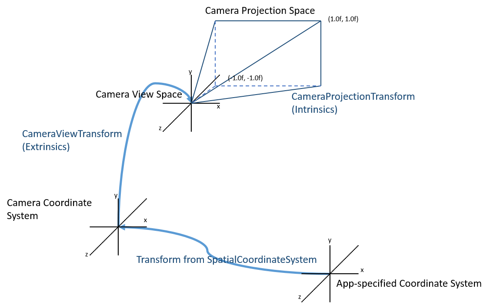

**ロケータブル カメラ**

HoloLens
には、世界を映し出すカメラがデバイス正面に搭載されており、ユーザーが目にしている世界をアプリで確認できるようになります。開発者は、スマートフォン、タブレット、デスクトップのカラー
カメラにアクセスするのと同じように、HoloLens
搭載のカメラにアクセスして、制御できます。モバイルやデスクトップで機能するユニバーサル
Windows [*Media
Capture*](https://msdn.microsoft.com/ja-jp/library/windows/apps/windows.media.capture.mediacapture.aspx)
API や Windows Media Foundation API が HoloLens でも機能します。Unity
でも[*これらの Windows API
をラップ*](https://developer.microsoft.com/ja-jp/windows/holographic/locatable_camera_in_unity)して
HoloLens
カメラのシンプルな用途を抽象化しています。たとえば、標準の写真やビデオを
(ホログラムを表示または非表示にして)
撮影したり、シーン全体の中でカメラの位置を定めるといった用途です。

**目次**

-   [*1 デバイス
    カメラ情報*](https://developer.microsoft.com/ja-jp/windows/holographic/locatable_camera#device_camera_information)

-   [*2 世界の中でのデバイス
    カメラの位置指定*](https://developer.microsoft.com/ja-jp/windows/holographic/locatable_camera#locating_the_device_camera_in_the_world)

    -   [*2.1
        画像と座標系*](https://developer.microsoft.com/ja-jp/windows/holographic/locatable_camera#images_with_coordinate_systems)

    -   [*2.2
        カメラからアプリ指定の座標系への変換*](https://developer.microsoft.com/ja-jp/windows/holographic/locatable_camera#camera_to_application-specified_coordinate_system)

    -   [*2.3
        アプリ指定の座標系からピクセル座標への変換*](https://developer.microsoft.com/ja-jp/windows/holographic/locatable_camera#application-specified_coordinate_system_to_pixel_coordinates)

    -   [*2.4
        ピクセルからアプリ指定の座標系への変換*](https://developer.microsoft.com/ja-jp/windows/holographic/locatable_camera#pixel_to_application-specified_coordinate_system)

    -   [*2.5
        歪み誤差*](https://developer.microsoft.com/ja-jp/windows/holographic/locatable_camera#distortion_error)

-   [*3 ロケータブル
    カメラの使用シナリオ*](https://developer.microsoft.com/ja-jp/windows/holographic/locatable_camera#locatable_camera_usage_scenarios)

    -   [*3.1
        撮影した写真やビデオの世界への表示*](https://developer.microsoft.com/ja-jp/windows/holographic/locatable_camera#show_a_photo_or_video_in_the_world_where_it_was_captured)

    -   [*3.1 カメラ
        シェーダーによる世界の描画*](https://developer.microsoft.com/ja-jp/windows/holographic/locatable_camera#painting_the_world_using_a_camera_shader)

    -   [*3.3
        タグ、パターン、ポスター、オブジェクトの追跡*](https://developer.microsoft.com/ja-jp/windows/holographic/locatable_camera#tag_.2F_pattern_.2F_poster_.2F_object_tracking)

    -   [*3.4
        カメラ位置からのホログラムのレンダリング*](https://developer.microsoft.com/ja-jp/windows/holographic/locatable_camera#render_holograms_from_the_camera.27s_position)

    -   [*3.5 LED やその他のレコグナイザー
        ライブラリを使用した、現実世界で静止状態または移動中のタグ付けされた対象物や顔の追跡と特定*](https://developer.microsoft.com/ja-jp/windows/holographic/locatable_camera#track_or_identify_tagged_stationary_or_moving_real-world_objects.2Ffaces_using_leds_or_other_recognizer_libraries)

-   [*4
    関連項目*](https://developer.microsoft.com/ja-jp/windows/holographic/locatable_camera#see_also)

**デバイス カメラ情報**

-   オート ホワイト
    バランス機能、自動露出機能、および完全画像処理パイプラインを備えた固定焦点式

-   カメラ アクティブ時に常時点灯する、世界と向き合う白色プライバシー
    LED

-   カメラは以下のモードを fps 30、24、20、15、5 でサポート
    (全モードの縦横比 16:9):

  **ビデオ**   **プレビュー**   **静止画**   **水平視野角 (H-FOV)**   **推奨用途**
  ------------ ---------------- ------------ ------------------------ ------------------------------------------------------------
  1280x720     1280x720         1280x720     45 度                    (既定)
  N/A          N/A              2048x1152    67 度                    最高解像度静止画
  1408x792     1408x792         1408x792     48 度                    ビデオの手振れ補正用のオーバースキャン (パディング) 解像度
  1344x756     1344x756         1344x756     67 度                    オーバースキャンによる視野角拡大ビデオ モード
  896x504      896x504          896x504      48 度                    画像処理タスク用省電力/低解像度モード

**世界の中でのデバイス カメラの位置指定**

HoloLens
で写真やビデオを撮ると、撮影されたフレームには、カメラの透視投影だけでなく、世界の中でのカメラの位置も含まれます。これにより、拡張画像処理のシナリオで、現実世界でのカメラ位置をアプリで論理的に判断できるようになります。開発者は、お気に入りの画像処理ライブラリやカスタム
コンピューター ビジョン
ライブラリを使用して、創造性のある独自のシナリオを扱うことができます。

HoloLens のドキュメントでは、「カメラ」が「仮想ゲーム カメラ」
(アプリのレンダリング先となる視錘台)
を指す箇所もあります。特に注意書きがない場合、ここでの「カメラ」は、現実世界の
RGB カラー カメラを指します。

このトピックの説明では [*Media Foundation
の属性*](https://msdn.microsoft.com/ja-jp/library/windows/desktop/mt740395%28v=vs.85%29.aspx)を取り上げていますが、[*WinRT
API*](https://msdn.microsoft.com/library/windows/apps/windows.media.devices.core.cameraintrinsics)
を使用してカメラの固有情報を取得する API もあります。

**画像と座標系**

各画像フレームには、写真でもビデオでも、座標系の他に 2
つの重要な変換が含まれます。1 つは "View" (ビュー)
変換で、指定された座標系からカメラにマップします。もう 1 つは
"Projection" (プロジェクション)
変換で、カメラから画像内のピクセルにマップします。この 2
つの変換によって、3D 空間内の光線の各ピクセルが定義されます。3D
空間内の光線は、そのピクセルを生み出す光子が辿る経路を表します。フレームの座標系から他の座標系
([*静止座標系*](https://developer.microsoft.com/ja-jp/windows/holographic/Coordinate_systems.html#stationary_frame_of_reference)など)
への変換を取得することで、こうした光線をアプリの他のコンテンツに関連付けることができます。つまり、各画像フレームは以下を提供します。

-   ピクセル データ (RGB、NV12、JPEG などの形式)

-   各フレームを「位置指定可能 (ロケータブル)」にする 3
    要素から成るメタデータ
    ([*IMFAttributes*](https://msdn.microsoft.com/ja-jp/library/windows/desktop/ms704598%28v=vs.85%29.aspx)
    として格納)。

  **属性名**                                              **型**                                                                                                                                                  **GUID**                                 **説明**
  ------------------------------------------------------- ------------------------------------------------------------------------------------------------------------------------------------------------------- ---------------------------------------- -------------------------------------------------------------------------------------------------------------------------------
  MFSampleExtension\_Spatial\_CameraCoordinateSystem      IUnknown ([*SpatialCoordinateSystem*](https://msdn.microsoft.com/ja-jp/library/windows/apps/windows.perception.spatial.spatialcoordinatesystem.aspx))   {9D13C82F-2199-4E67-91CD-D1A4181F2534}   撮影されたフレームの[*座標系*](https://developer.microsoft.com/ja-jp/windows/holographic/coordinate_systems_in_directx)を格納
  MFSampleExtension\_Spatial\_CameraViewTransform         Blob ([*Matrix4x4*](https://msdn.microsoft.com/ja-jp/library/windows/apps/windows.foundation.numerics.matrix4x4.aspx))                                  {4E251FA4-830F-4770-859A-4B8D99AA809B}   その座標系内でのカメラの外部変換を格納
  MFSampleExtension\_Spatial\_CameraProjectionTransform   Blob ([*Matrix4x4*](https://msdn.microsoft.com/ja-jp/library/windows/apps/windows.foundation.numerics.matrix4x4.aspx))                                  {47F9FCB5-2A02-4F26-A477-792FDF95886A}   カメラのプロジェクション変換を格納

プロジェクション変換は、画像平面にマップされるレンズ固有のプロパティ
(焦点距離、プロジェクションの中心、歪み) を表します。画像平面の範囲は X
軸も Y 軸も -1 ～ 1 です。

Matrix4x4 形式 項

m11 m12 m13 m14 fx 0 0 0

m21 m22 m23 m24 skew fy 0 0

m31 m32 m33 m34 cx cy A -1

m41 m42 m43 m44 0 0 B 0

アプリが変われば座標系も異なります。以下の図は、1 つのアプリのカメラ
ピクセルの位置を指定するまでの流れを大まかに示しています。

**カメラからアプリ指定の座標系への変換**

カメラのビュー (CameraView ) とカメラの座標系 (CameraCoordinateSystem)
からアプリの座標系またはワールド座標系に変換するには、以下が必要です。

[*Unity でのロケータブル
カメラ*](https://developer.microsoft.com/ja-jp/windows/holographic/locatable_camera_in_unity):
CameraToWorldMatrix は、PhotoCaptureFrame クラスから自動的に提供されます
(そのため、CameraCoordinateSystem を意識する必要はありません)。

[*DirectX でのロケータブル
カメラ*](https://developer.microsoft.com/ja-jp/windows/holographic/locatable_camera_in_directx):
カメラの座標系とアプリの座標系との変換をクエリする非常に簡単な方法を示します。

**アプリ指定の座標系からピクセル座標への変換**

カメラ画像で特定の 3D 位置を探したり、その位置に描画するとします。

ビュー変換とプロジェクション変換はどちらも 4x4
の行列ですが、利用方法は若干異なります。違いの 1
つは、プロジェクション変換実行後に「w
で正規化」することです。プロジェクション変換でのこの追加手順によって、複数の異なる
3D 位置が最終的には画面上の同じ 2D
位置になることをシミュレーションしています
(つまり、特定の光線に沿うものはすべて同じピクセルに表示されます)。そのため、(シェーダー
コードでの) 重要なポイントは以下のようになります。

// Usual 3d math:

float4x4 WorldToCamera = inverse( CameraToWorld );

float4 CameraSpacePos = mul( WorldToCamera, float4( WorldSpacePos.xyz, 1
) ); // use 1 as the W component

// Projection math:

float4 ImagePosUnnormalized = mul( CameraProjection, float4(
CameraSpacePos.xyz, 1 ) ); // use 1 as the W component

float2 ImagePosProjected = ImagePosUnnormalized.xy /
ImagePosUnnormalized.w; // normalize by W, gives -1 to 1 space

float2 ImagePosZeroToOne = ( ImagePosProjected \* 0.5 ) + float2( 0.5,
0.5 ); // good for GPU textures

int2 PixelPos = int2( ImagePosZeroToOne.x \* ImageWidth, ( 1 -
ImagePosZeroToOne.y ) \* ImageHeight ); // good for CPU textures

**ピクセルからアプリ指定の座標系への変換**

ピクセルからワールド座標系への変換はやや複雑です。

float2 ImagePosZeroToOne = float2( PixelPos.x / ImageWidth, 1.0 -
(PixelPos.y / ImageHeight ) );

float2 ImagePosProjected = ( ( ImagePosZeroToOne \* 2.0 ) - float2(1,1)
); // -1 to 1 space

float3 CameraSpacePos = UnProjectVector( Projection, float3(
ImagePosProjected, 1) );

float3 WorldSpaceRayPoint1 = mul( CameraToWorld, float4(0,0,0,1) ); //
camera location in world space

float3 WorldSpaceRayPoint2 = mul( CameraToWorld, CameraSpacePos ); //
ray point in world space

ここで、UnProject を次のように定義します。

public static Vector3 UnProjectVector(Matrix4x4 proj, Vector3 to)

{

Vector3 from = new Vector3(0, 0, 0);

var axsX = proj.GetRow(0);

var axsY = proj.GetRow(1);

var axsZ = proj.GetRow(2);

from.z = to.z / axsZ.z;

from.y = (to.y - (from.z \* axsY.z)) / axsY.y;

from.x = (to.x - (from.z \* axsX.z)) / axsX.x;

return from;

}

あるポイントの世界の中での実際の位置を探すには、世界の 2
本の光線とその交点を見つけるか、そのポイントの既知サイズが必要になります。

**歪み誤差**

HoloLens では、ビデオ
ストリームと静止画ストリームは、システムの画像処理パイプラインで歪みが補正された後、補正後のフレームがアプリで利用できるようになります
(プレビュー
ストリームにはオリジナルの歪みのあるフレームが含まれます)。アプリでは、プロジェクション行列しか利用可能にならないため、画像フレームが完璧なピンホール
カメラを表していることを想定する必要があります。ただし、画像処理パイプラインの歪み補正関数では、フレームのメタデータでプロジェクション行列を使用する際に最大
10 ピクセルの誤差が残ることがあります。多くのユース
ケースでは、この誤差は問題になりません。しかし、一例として、ホログラムを現実世界のポスターやマーカーの位置に合わせようとする場合、10
ピクセル以下の食い違い (2 m 離れたホログラムの場合で 11 mm 程度)
がわかるとしたら、この歪み誤差が原因になっている可能性があります。

**ロケータブル カメラの使用シナリオ**

**撮影した写真やビデオの世界への表示**

デバイス
カメラのフレームには、「カメラから世界への」変換が含まれています。この変換は、画像撮影時のデバイス
カメラの正確な位置を示すために使用できます。たとえば、小さなホログラフィック
アイコンをこの場所 (CameraToWorld.MultiplyPoint(Vector3.zero))
に位置指定したり、カメラが向いている方向
(CameraToWorld.MultiplyVector(Vector3.forward))
に小さな矢印を描画することもできます。

**カメラ シェーダーによる世界の描画**

ここでは、デバイス
カメラのビュー内での表示場所を基準として世界に着色するマテリアル「シェーダー」を作成します。実際には、すべての頂点の位置をカメラからの相対で算出してから、各ピクセル「プロジェクション行列」を利用して、ピクセルをどの画像テクスチャに関連付けるかを算出します。最後に、オプションとして、画像の隅をフェード
アウトして、夢の中のでき事のように画像を表示します。

// In the vertex shader:

float4 worldSpace = mul( ObjectToWorld, float4( vertexPos.xyz, 1));

float4 cameraSpace = mul( CameraWorldToLocal, float4(worldSpace.xyz,
1));

// In the pixel shader:

float4 unprojectedTex = mul( CameraProjection, float4( cameraSpace .xyz,
1));

float2 projectedTex = (unprojectedTex.xy / unprojectedTex.w);

float2 unitTexcoord = ((projectedTex \* 0.5) + float4(0.5, 0.5, 0, 0));

float4 cameraTextureColor = tex2D(\_CameraTex, unitTexcoord);

// Fade out edges for better look:

float pctInView = saturate((1.0 - length(projectedTex.xy)) \* 3.0);

float4 finalColor = float4( cameraTextureColor.rgb, pctInView );

**タグ、パターン、ポスター、オブジェクトの追跡**

多くの複合現実アプリでは、認識可能な画像やビジュアル
パターンを使って空間内に追跡可能なポイントを作成します。その後、このポイントを利用して、そのポイントから相対に対象物をレンダリングしたり、既知の場所を作成します。HoloLens
の使い方の中には、基準マークでタグ付けされた現実世界の対象物 (QR
コード付きのテレビ モニターなど)
を探して、その基準マーク上にホログラムを配置し、Wi-Fi 経由で HoloLens
と通信するように設定された、タブレットなどの非 HoloLens
デバイスとホログラムを表示上ペアリングするものもあります。

ビジュアル
パターンを認識し、アプリの仮想空間にその対象物を配置するには、以下のものが必要です。

1.  画像パターン認識ツールキット (QR コード、AR タグ、顔検知、サークル
    トラッカー、OCR など)

2.  実行時の画像フレームの収集と、その画像フレームの認識レイヤーへの受け渡し

3.  画像位置から世界での位置 (おそらく、世界での光線)
    への逆プロジェクション

4.  これらの世界の位置での仮想モデルの位置指定

画像処理に関する重要なリンク:

-   [*OpenCV*](http://opencv.org/)

-   [*QR コード*](https://en.wikipedia.org/wiki/QR_code)

-   [*FaceSDK*](http://research.microsoft.com/en-us/projects/facesdk/)

-   [*Microsoft
    Translator*](https://www.microsoft.com/ja-jp/translator/products.aspx)

インタラクティブなアプリではフレーム
レートを維持することが不可欠です。画像認識アルゴリズムの処理に時間がかかる場合は特にフレーム
レートの維持が重要です。そのため、通常は以下のパターンを使用します。

1.  メイン スレッド: カメラ オブジェクトを管理します。

2.  メイン スレッド: 新しいフレームを要求します (非同期)。

3.  メイン スレッド: 新しいフレームを追跡スレッドに渡します。

4.  追跡スレッド: 画像を処理して重要なポイントを収集します。

5.  メイン スレッド:
    見つかった重要なポイントに合わせて仮想モデルを移動します。

6.  メイン スレッド: 手順 2. 以降を繰り返します。

画像マーカー システムにはピクセル位置を 1
つしか提供しないマーカーもあります
(完全な変換を提供するマーカーもあります。その場合、この説明は必要ありません)。このピクセル位置は、可能性のある位置の
1 本の光線に相当します。3D 位置を 1
つ取得するには、複数本の光線を利用して、その光線のおおよその交点から最終結果を求めます。そのためには、以下の手順が必要です。

1.  複数のカメラ画像を収集するループを取得します。

2.  [*関連付けられた特徴点*](https://developer.microsoft.com/ja-jp/windows/holographic/#pixel_to_application-specified_coordinate_system)と、その世界での光線を検索します。

3.  特徴点の辞書があり、特徴点ごとに世界での光線が複数本存在する場合、次のコードを使用してこれらの光線の交点を求めます。

public static Vector3 ClosestPointBetweenRays(

Vector3 point1, Vector3 normalizedDirection1,

Vector3 point2, Vector3 normalizedDirection2) {

float directionProjection = Vector3.Dot(normalizedDirection1,
normalizedDirection2);

if (directionProjection == 1) {

return point1; // parallel lines

}

float projection1 = Vector3.Dot(point2 - point1, normalizedDirection1);

float projection2 = Vector3.Dot(point2 - point1, normalizedDirection2);

float distanceAlongLine1 = (projection1 - directionProjection \*
projection2) / (1 - directionProjection \* directionProjection);

float distanceAlongLine2 = (projection2 - directionProjection \*
projection1) / (directionProjection \* directionProjection - 1);

Vector3 pointOnLine1 = point1 + distanceAlongLine1 \*
normalizedDirection1;

Vector3 pointOnLine2 = point2 + distanceAlongLine2 \*
normalizedDirection2;

return Vector3.Lerp(pointOnLine2, pointOnLine1, 0.5f);

}

追跡対象タグの位置が 2
つ以上ある場合は、ユーザーの現在のシナリオに合うようにモデル化されたシーンの位置を調整できます。重力を想定しない場合は、タグの位置が
3
つ必要です。多くの場合は単純な配色を使用して、リアルタイムの追跡対象タグの位置を白い球体で表し、モデル化されたタグの位置を青い球体で表します。これにより、ユーザーは位置合わせの良し悪しを視覚的に判断できます。今回示すすべてのアプリでは、次のような設定を想定しています。

-   モデル化されたタグの位置が 2 つ以上

-   シーン内でタグの親になる「キャリブレーション空間」が 1 つ

-   カメラ特徴点の ID

-   モデル化されたタグとリアルタイム
    タグ位置合わせするためにキャリブレーション空間を移動する動作
    (モデル化されたマーカー自体ではなく、親空間を移動することに注意します。ほかの接続はモデル化されたマーカーと相対に位置が決まるためです)

// In the two tags case:

Vector3 idealDelta = (realTags\[1\].EstimatedWorldPos -
realTags\[0\].EstimatedWorldPos);

Vector3 curDelta = (modelledTags\[1\].transform.position -
modelledTags\[0\].transform.position);

if (IsAssumeGravity) {

idealDelta.y = 0;

curDelta.y = 0;

}

Quaternion deltaRot = Quaternion.FromToRotation(curDelta, idealDelta);

trans.rotation = Quaternion.LookRotation(deltaRot \* trans.forward,
trans.up);

trans.position += realTags\[0\].EstimatedWorldPos -
modelledTags\[0\].transform.position;

**カメラ位置からのホログラムのレンダリング**

メモ: ホログラムとカメラ ストリームを融合する独自の[*複合現実キャプチャ
(MRC)*](https://developer.microsoft.com/ja-jp/windows/holographic/mixed_reality_capture)
の作成を考えている場合、MRC 効果を使用するか、[*Unity のロケータブル
カメラ*](https://developer.microsoft.com/ja-jp/windows/holographic/locatable_camera_in_unity)で
showHolograms プロパティを有効にします。

RGB カメラ ストリームで特殊なレンダリングを直接実行する場合、ビデオ
フィードと同期しながら、カメラの位置から空間内のホログラムをレンダリングできます。それにより、カスタム
ホログラムの録画やライブ プレビューが実現します。

Skype ではこのしくみを利用して、HoloLens
ユーザーが見ている世界をリモート
クライアントに表示し、ユーザーどうしが同じホログラムを操作できるようにしています。Skype
サービスを経由して各ビデオ
フレームを送信する前に、各フレームに対応するカメラ
データを取得します。次に、そのカメラの外部メタデータとカメラ固有のメタデータをビデオ
フレームと一緒にパッケージ化し、それを Skype サービス経由で送信します。

受信側では、Unity を使用して、同じ座標系を使用する HoloLens
ユーザーの空間で、すべてのホログラムがすぐに同期されます。これにより、カメラの外部メタデータを使用して、ビデオ
フレームが撮影されたときにその HoloLens ユーザーが立っていた
(他のすべてのホログラムと相対の) 世界での正確な位置に、Unity
カメラを配置できます。さらに、カメラ固有の情報を使用して、表示がまったく同じになるようにしています。

カメラを適切に設定したら、カメラから見たホログラムを Skype
から受信したフレームと融合し、Graphics.Blit を使用して HoloLens
ユーザーが目にする複合現実の視野を作り出します。

private void OnFrameReceived(Texture frameTexture, Vector3
cameraPosition, Quaternion cameraRotation, Matrix4x4
cameraProjectionMatrix)

{

//set material that will be blitted onto the RenderTexture

this.compositeMaterial.SetTexture(CompositeRenderer.CameraTextureMaterialProperty,
frameTexture);

//set the camera to be that of the HoloLens's device camera

this.Camera.transform.position = cameraPosition;

this.Camera.transform.rotation = cameraRotation;

this.Camera.projectionMatrix = cameraProjectionMatrix;

//trigger the Graphics's Blit now that the frame and camera are set up

this.TextureReady = false;

}

private void OnRenderImage(RenderTexture source, RenderTexture
destination)

{

if (!this.TextureReady)

{

Graphics.Blit(source, destination, this.compositeMaterial);

this.TextureReady = true;

}

}

**LED やその他のレコグナイザー
ライブラリを使用した、現実世界で静止状態または移動中のタグ付けされた対象物や顔の追跡と特定**

例:

-   LED (または動作の遅いオブジェクト向けに QR コード)
    を備えた産業ロボット

-   室内にある物体の識別と認識

-   室内にいる人間の識別と認識
    (ホログラフィックの連絡先カードを顔の上に表示するなど)

**関連項目**

-   [*DirectX でのロケータブル
    カメラ*](https://developer.microsoft.com/ja-jp/windows/holographic/locatable_camera_in_directx)

-   [*Unity でのロケータブル
    カメラ*](https://developer.microsoft.com/ja-jp/windows/holographic/locatable_camera_in_unity)

-   [*複合現実キャプチャ*](https://developer.microsoft.com/ja-jp/windows/holographic/mixed_reality_capture)

-   [*開発者向け複合現実キャプチャ*](https://developer.microsoft.com/ja-jp/windows/holographic/mixed_reality_capture_for_developers)

-   [*MediaCapture
    を使った基本的な写真、ビデオ、およびオーディオのキャプチャ*](https://msdn.microsoft.com/ja-jp/library/windows/apps/mt243896.aspx)

