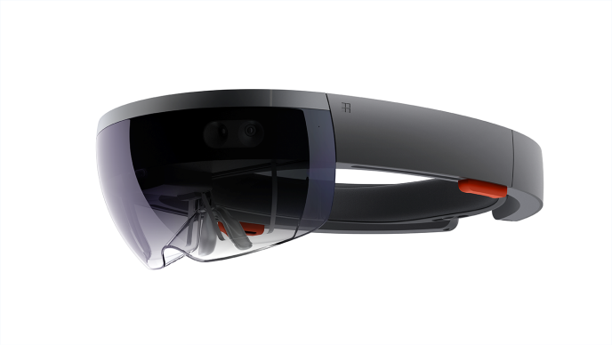
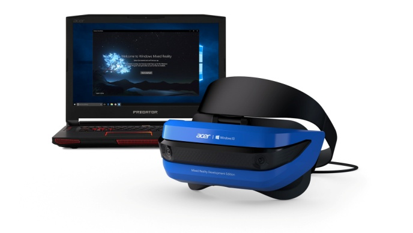

**複合現実**

複合現実とは、現実の世界とデジタルの世界を融合したものです。複合現実は、人間、コンピューター、環境の相互の関係を新たなレベルに進化させるもので、これまでの想像力の限界を打ち破り、可能性を大きく広げます。これを可能にしているのは、コンピューター
ビジョン、グラフィック処理能力、ディスプレイ
テクノロジ、および入力システムの進化です。「複合現実 (Mixed
Reality)」という言葉が初めて使われたのは、Paul Milgram
氏と岸野文郎氏の共同執筆論文「[*A Taxonomy of Mixed Reality Visual
Displays*](http://etclab.mie.utoronto.ca/people/paul_dir/IEICE94/ieice.html)」(1994
年) でした。この論文では「仮想感覚の連続したつながり (virtuality
continuum)」という考え方が取り入れられ、この考え方がディスプレイの分類方法を中心に論じられています。その後、複合現実という言葉の範囲はディスプレイだけにとどまらず、環境入力、空間サウンドや場所にまで広がっていきます。

**目次**

-   [*1.
    環境入力と認識*](https://developer.microsoft.com/ja-jp/windows/mixed-reality/mixed_reality#environmental_input_and_perception)

-   [*2.
    複合現実スペクトル*](https://developer.microsoft.com/ja-jp/windows/mixed-reality/mixed_reality#the_mixed_reality_spectrum)

-   [*3.
    デバイスとエクスペリエンス*](https://developer.microsoft.com/ja-jp/windows/mixed-reality/mixed_reality#devices_and_experiences)

-   [*4
    関連項目*](https://developer.microsoft.com/ja-jp/windows/mixed-reality/mixed_reality#see_also)

**環境入力と認識**

過去数十年、人間による入力とコンピューターによる入力の関係は十分な調査が行われてきました。これは「人間とコンピュータとの相互作用
(HCI: Human Computer
Interaction)」とも呼ばれる広範な研究分野でもあります。人間による入力は、キーボード、マウス、タッチ、手書き、音声、Kinect
骨格トラッキングなど、さまざまな方法で行われます。

センサーや処理能力が進化し、コンピューターによる環境からの入力という新たな分野が生まれています。このコンピューターと環境との相互作用は、突き詰めれば環境を理解すること、つまり「認識」です。そのため、環境情報を明らかにする
API は、Windowsでは[*認識 (perception)
API*](https://docs.microsoft.com/ja-jp/uwp/api/Windows.Perception)
と呼ばれています。環境入力が取り込むのは、世界の中での人物の位置
([*ヘッド
トラッキング*](https://developer.microsoft.com/ja-jp/windows/mixed-reality/coordinate_systems)など)、面と境界
([*空間マッピング*](https://developer.microsoft.com/ja-jp/windows/mixed-reality/spatial_mapping)や[*空間の把握*](https://developer.microsoft.com/ja-jp/windows/mixed-reality/case_study_-_expanding_the_spatial_mapping_capabilities_of_hololens)など)、アンビエント照明、環境音、オブジェクト認識、場所などです。

コンピューターの処理、人間による入力、環境入力の 3
つすべてが組み合わされるようになった今、真の複合現実体験を生み出せるようになります。現実世界での動きがデジタル世界での動きに変換されます。現実世界の境界が、デジタル世界でのアプリ体験
(ゲーム プレイなど)
に影響を与えます。環境入力がなければ、現実世界とデジタル世界の融合体験は叶いません。

**複合現実スペクトル**

現実世界とデジタル世界を融合するのが複合現実なので、この 2
つの世界が仮想感覚の連続したつながりを表すスペクトルの対極を定義します。説明を簡単にするために、ここではこのつながりを「複合現実スペクトル」と呼びます。スペクトルの左側は、私たち人間が存在する現実世界です。そして、右側が対応するデジタル世界です。

現在市場に出回っているスマートフォンの大半は環境認識能力が無きに等しい状況です。そのため、スマートフォンが提供するエクスペリエンスでは、現実世界とデジタル仮想を混在させることはできません。現実世界のビデオ
ストリームにグラフィックスを重ねるエクスペリエンスが「拡張現実」です。デジタル
エクスペリエンスを提供するために視野を塞ぐエクスペリエンスが「仮想現実」です。そして、以下に示すようにこの両者の間に位置するエクスペリエンスが「複合現実」です。

-   現実の世界を出発点として、実際にそこに存在するかのように、ホログラムなどのデジタル
    オブジェクトを配置します。

-   現実の世界を出発点として、メモを残すときに、別の人物のデジタル表現
    (アバター)
    で、その人物が立っていた場所を示します。つまり、別の時点での非同期コラボレーションを表すエクスペリエンスです。

-   デジタルの世界を出発点として、エクスペリエンス内部に現実世界の物理境界
    (壁や家具など)
    をデジタルに出現させ、物理的な対象物をユーザーが避けられるようにします。

今日市場で入手できるほとんどの拡張現実や仮想現実は、このスペクトルのごくわずかな部分しか表していません。とはいえ、どちらもさらに大きな複合現実スペクトルのサブセットにはなっています。Windows
10
はこのスペクトル全体を念頭においてビルドされているため、現実世界の人物、場所、物体のデジタル表現を融合することができます。

Windows Mixed Reality のエクスペリエンスを提供するデバイスは主に以下の 2
種類があります。

1.  **ホログラフィック
    デバイス。**このデバイスの特徴的な能力は、現実世界に実際に存在するかのようにデジタル
    コンテンツを配置できることです。

2.  **没入型デバイス。**このデバイスの特徴的な能力は、現実の世界を隠し、それをデジタル
    エクスペリエンスに置き換えて、「存在感」を生み出すことです。

  ----------------------------------------------------------------------------------------------------------------------------------------------------------------------------------------------------------------------
  **特性**       **ホログラフィック デバイス**                                                            **没入型デバイス**
  -------------- ---------------------------------------------------------------------------------------- --------------------------------------------------------------------------------------------------------------
  デバイス例     Microsoft HoloLens\                                                                      Acer Windows Mixed Reality Development Edition\
                 {width="3.0625in" height="1.75in"}          {width="3.0625in" height="1.75in"}

  ディスプレイ   *「透過型ディスプレイ」ユーザーはヘッドセット着用中に現実の環境を見ることができます。*   *「非透過型ディスプレイ」ヘッドセット着用中は現実の環境が遮断されます。*

  動き           回転と移動の両方で、全 6 自由度 (6DoF: six-degrees-of-freedom) 対応                      回転と移動の両方で、全 6 自由度 (6DoF: six-degrees-of-freedom) 対応
  ----------------------------------------------------------------------------------------------------------------------------------------------------------------------------------------------------------------------

注: デバイスが別の PC に接続される (USB ケーブルや Wi-Fi 経由)
接続型か自立型 (非接続)
かによって、デバイスがホログラフィックか没入型かが決まるわけではありません。もちろん、携行性を高める機能は優れたエクスペリエンスにつながります。ホログラフィック
デバイスと没入型デバイスは、どちらも接続型にも非接続型にもなり得ます。

**デバイスとエクスペリエンス**

複合現実のエクスペリエンスを実現しているのは、テクノロジの進化です。現状、スペクトル全体のエクスペリエンスを実現できるデバイスはありません。ただし、Windows
10
により、デバイスのメーカーにも開発者にも共通の複合現実プラットフォームが提供されます。現状のデバイスがサポートできるのは、複合現実スペクトルの特定範囲です。やがて、この範囲を拡大する新たなデバイスが登場します。将来は、ホログラフィック
デバイスは没入型に近づき、没入型デバイスはホログラフィックに近づいていくと考えられます。

多くの場合、アプリやゲームの開発者は、どの種類のエクスペリエンスを作成するかを考えるのがお勧めです。そのエクスペリエンスのターゲットは、一般に、スペクトルの特定のポイントまたは特定部分に定めることになります。次に、開発者は、ターゲットにするデバイスの機能を考えます。たとえば、現実世界を中心とするエクスペリエンスには
HoloLens が最適といえるでしょう。

-   **スペクトルの左方向
    (現実世界に近い方向)。**ユーザーは現実世界に存在したままで、現実世界から離れたと感じないようにします。

-   **中央付近
    (完全な複合現実)。**現実世界とデジタル世界が完全に融合されるエクスペリエンスです。映画「[*ジュマンジ*](https://en.wikipedia.org/wiki/Jumanji)」をご覧になった方は、作中の舞台となる家の物理的構造がジャングルの環境と融合される場面を思い浮かべてください。

-   **スペクトルの右方向
    (仮想世界に近い方向)。**ユーザーのエクスペリエンスは完全にデジタル環境の中で起こります。自身を取り巻く現実の環境で起きていることには気付きません。

上の図は、複合現実スペクトルの位置に応じて利用可能なさまざまなエクスペリエンスを示しています。

-   **Microsoft HoloLens での
    Skype。**別のユーザーの現実環境に描画することでコラボレーションを可能にします。このエクスペリエンスは依然として現実の環境がアクティビティの場所になるため、現状ではスペクトルのかなり左寄りになります。

-   **Fragments** と
    **RoboRaid。**どちらも、ユーザーの現実環境、つまり壁、床、家具のレイアウトを利用し、この現実世界にデジタル
    コンテンツを配置します。このエクスペリエンスは、スペクトルでは先ほどよりもかなり右寄りになりますが、ユーザーは常に自身の現実世界にいる感覚です。

-   **Microsoft HoloLens での HoloTour。**HoloTour
    は没入型体験を念頭に設計されています。ユーザーは観光地周辺を歩き回ります。HoloTour
    を HoloLens で利用することでこのデバイスの没入感の幅が広がります。

-   **没入型デバイスでの HoloTour。**没入型デバイスで HoloTour
    を実行して、ユーザーが観光地を歩き回れるようにしながら、同時に環境入力を表示します。ユーザーが壁にぶつからないようにする境界を設けるのはさらに高度な機能を表し、スペクトルでは中央寄りのエクスペリエンスになります。

-   **360°の動画。**並進運動のような環境入力は動画再生エクスペリエンスに影響しないため、このエクスペリエンスはかなり右寄りのデジタル環境近くになります。実際には、スペクトラム右端の仮想現実を意味する狭い領域に入ります。

Skype for HoloLens、Fragments と RoboRaid は、HoloLens
で体感するのに最適なエクスペリエンスです。同様に、360°の動画は没入型デバイスで体感するのに最適なエクスペリエンスです。複合現実スペクトルの中央寄りのエクスペリエンスを試すときは、現状では、どちらの種類のデバイスでも
HoloTour によって最適なエクスペリエンスが提供されます。

**関連項目**

-   [*API リファレンス:
    Windows.Perception*](https://docs.microsoft.com/ja-jp/uwp/api/Windows.Perception)

-   [*API リファレンス:
    Windows.Perception.Spatial*](https://docs.microsoft.com/ja-jp/uwp/api/Windows.Perception.Spatial)

-   [*API リファレンス:
    Windows.Perception.Spatial.Surfaces*](https://docs.microsoft.com/ja-jp/uwp/api/Windows.Perception.Spatial.Surfaces)

