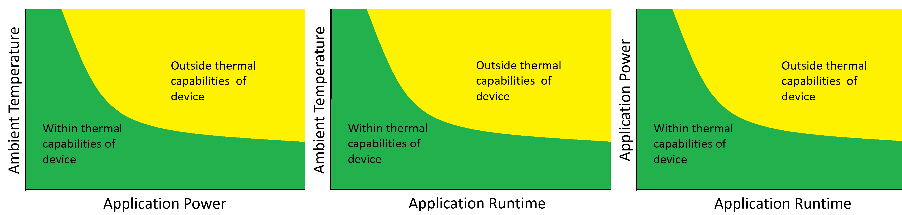
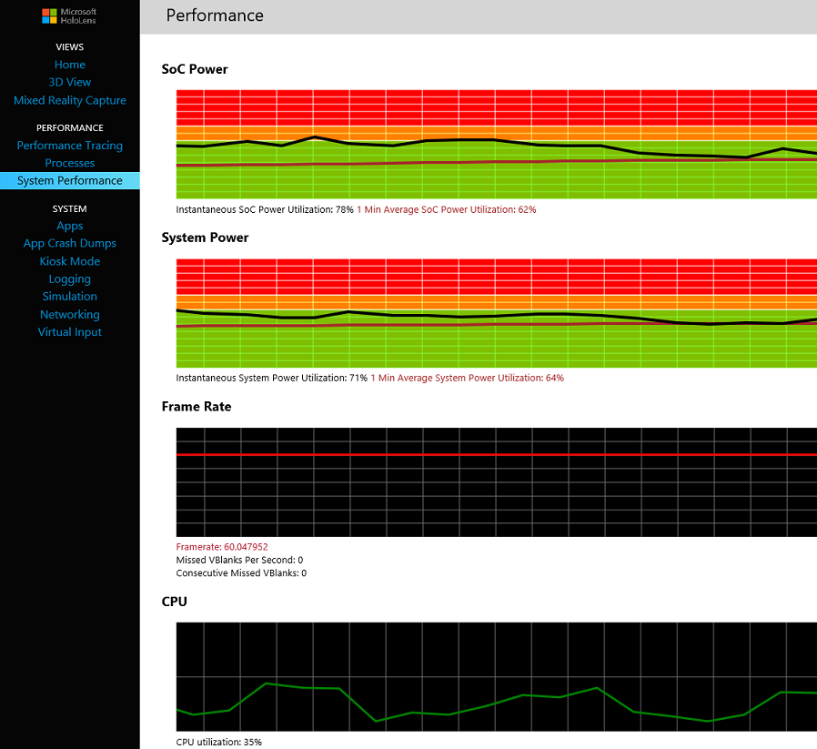
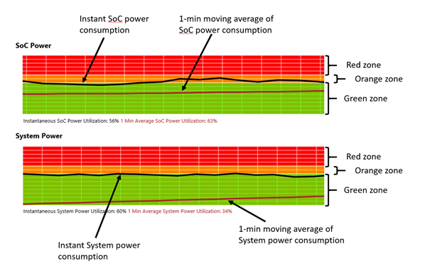

**HoloLens アプリのパフォーマンスの推奨事項**

HoloLens
では、PC、スマートフォン、または外部カメラに有線接続することなく、没入型のホログラフィック
エクスペリエンスを表現できます。これを実現するため、HoloLens はパッシブ
クーリングを備え、平均的ノート PC
よりも優れたコンピューティング能力を有しています。このパッシブ
クーリングは放熱ファンを必要としないため、ユーザー
エクスペリエンスを妨げる騒音が生じません。

センサーの処理は Holographic Processing Unit (HPU)
にオフロードされます。この HPU は、HoloLens が取り込むカメラ
データの処理に特化して設計されており、ホログラムの表示を安定させ、視線入力やジェスチャー入力をリアルタイムに追跡できるようにします。センサー
フュージョンを HPU にオフロードすることで、ホスト
プロセッサをアプリに解放し、同時に、追跡インフラストラクチャのリアルタイム要件も確保します。

HoloLens アプリの開発は一般的なデスクトップ
アプリケーションの開発とは異なり、仮想世界の動きに合わせてユーザーの視野をすばやく更新する必要があります。ホログラフィック
オブジェクトの外観を物理法則に従ってシミュレーションするには、両方の目にそれぞれ別の表示フレームを映し出す必要があります。ユーザーの動きに合わせて遅延を最小限に抑えながら映像表現を更新し、仮想世界のオブジェクトと現実世界のオブジェクトにずれが生じないようにしなければなりません。このため、ホログラフィック
アプリのレンダリング パイプラインは、一人称視点の 3D
ゲームのレンダリング パイプラインによく似ています。ただし、モバイル
チップ セットでは、フォワード
レンダリングの能力は遅延パイプラインに比べて劣ります。

**目次**

-   [*1
    パフォーマンスのガイドライン*](https://developer.microsoft.com/ja-jp/windows/mixed-reality/performance_recommendations_for_hololens_apps#performance_guidelines)

-   [*2
    開発プロセスのガイダンス*](https://developer.microsoft.com/ja-jp/windows/mixed-reality/performance_recommendations_for_hololens_apps#development_process_guidance)

-   [*3
    コンテンツのガイダンス*](https://developer.microsoft.com/ja-jp/windows/mixed-reality/performance_recommendations_for_hololens_apps#content_guidance)

-   [*4
    ツール*](https://developer.microsoft.com/ja-jp/windows/mixed-reality/performance_recommendations_for_hololens_apps#tools)

    -   [*4.1 Windows Device Portal -
        パフォーマンス*](https://developer.microsoft.com/ja-jp/windows/mixed-reality/performance_recommendations_for_hololens_apps#windows_device_portal_-_performance)

    -   [*4.2 システム
        パフォーマンス*](https://developer.microsoft.com/ja-jp/windows/mixed-reality/performance_recommendations_for_hololens_apps#system_performance)

**パフォーマンスのガイドライン**

ホログラフィック
アプリで最適な没入型エクスペリエンスを実現するには、表示の複雑さ、表示フレーム
レート、レンダリングの遅延、入力の遅延、熱による電力消費、およびバッテリー寿命のバランスを取る必要があります。ユーザーが快適と感じるには、遅延を最小限に抑え、一貫して高いフレーム
レートを実現することが重要です。アプリでは、遅延を 1
フレームに抑え、毎秒 60 フレーム (60 fps) を目標にします。HoloLens
のディスプレイ
パイプラインは、非常に高い頻度の追跡情報を基に表示するフレームを細かく修正することによって、ディスプレイのネイティブ
フレーム レートに一致するようにアプリのフレーム
レートを高めることができるようにします。ユーザーのホログラフィック環境で、現実世界のオブジェクトのように動く安定したホログラムを実現するためには、このことが非常に重要になります。

アプリが目標のディスプレイ
レートを実現するようになったら、電力消費量を監視して、HoloLens
の温度や電力の設計上の許容範囲内でアプリが確実に動作するようにします。

フレーム レートと電力消費量はどちらも、HoloLens Device Management System
Performance (HoloLens デバイス管理システム パフォーマンス)
ビューで確認できます。

**最重要パフォーマンス目標**

  **メトリック**                                                                                                        **目標**
  --------------------------------------------------------------------------------------------------------------------- ----------------------------------------------------------------------------------------------------------------------
  [*フレーム レート*](https://developer.microsoft.com/ja-jp/windows/mixed-reality/Hologram_stability.html#frame_rate)   60 fps
  電力消費量                                                                                                            1 分平均がオレンジ ゾーンおよびグリーン ゾーン内。後半の「システム パフォーマンス ツール」の情報を参照してください。
  メモリ                                                                                                                総コミット 900 MB 未満

ヒント: アプリが 60 fps
近くまで達していない場合、電力消費量が低くく示され、誤解が生じる可能性があります。そのため、アプリが目標のフレーム
レート近くまで達するようになってから、電力消費量を計測するようにしてください。

**開発プロセスのガイダンス**

HoloLens
のレンダリングはリアルタイムで遅延が短いことを求められるため、開発プロセスのごく初期段階からパフォーマンスを意識することが非常に重要です。一般的ガイダンスとしては、できる限り開発サイクルの早い段階で
[*60
fps*](https://developer.microsoft.com/ja-jp/windows/mixed-reality/Hologram_stability.html#frame_rate)
の達成を目指します。60 fps を達成したら、フレーム
レートを維持しながらの電力消費の監視に注力します。

消費電力を測定して最適化するときは、スクリプト化したウォークスルーをサポートすると非常に有効です。このようなウォークスルーを使用すれば、電力消費量とパフォーマンスを繰り返し測定できます。

**コンテンツのガイダンス**

ここでは、アプリの広範な推奨事項、特に表示の複雑さについての推奨事項を取り上げます。こうした事項は一連のガイドラインで、厳しい制限ではありません。多くの場合、さまざまな効果や機能は、パフォーマンスと引き換えになる可能性があります。

**全般**

-   ピクセルのレンダリングの多くはボトルネックになるため、大量のピクセル描画や、負荷の高いシェーダーの使用は避けます。

    -   範囲を超えた描画は制限します。1 ～ 1.5
        倍の範囲を超えない描画を目指します。

    -   可能な場合は範囲を超えた描画、ジオメトリ、およびテクスチャ
        サンプルを減らして、メモリ帯域幅を制限します。可能な場合は、Mip
        マップを使用します。

    -   複雑な表示やジオメトリに許容できる範囲で、解像度を落とすことを検討します。

    -   FXAA や SSAO など、全画面効果の使用は避けます。

-   描画呼び出しをバッチ処理し、DirectX
    のオーバーヘッドを最小限に抑えるインスタンス作成を使用します。

-   タスクの存在間隔に合わせて、CPU/GPU をすばやく休止状態にします。.

-   16 ビットの深度バッファーを使用します。

-   プロジェクトで使用しない物理特性はオフにします。

**ジオメトリ**

-   左目と右目を組み合わせた視錘台に対して、視錘台カリングを実行します。

-   ある程度の頭の動きを考慮して、カリングする視錐台を約 5 度緩めます。

-   カリングには直前のフレームの頭部姿勢を使用し、実際のレンダリングには可能なかぎり最新の
    [*HolographicFrame*](https://developer.microsoft.com/ja-jp/windows/mixed-reality/rendering_in_directx)
    を取得します。

-   モデルの複雑さを調整し、遠方のホログラムには詳細レベルを下げたシンプルなメッシュを作成します。

-   Visual Studio のグラフィック
    ツールを使用してシーンを測定し、頂点シェーダーやピクセル
    シェーダーがボトルネックになっているかどうかを確認して、適宜最適化します。

-   サブピクセルの三角形は非常に負荷が高くなります。

-   静的ジオメトリを前面から後面へと描画していくことで、見えないピクセルを描画しないようにします。

-   ジオメトリ シェーダー、ハル
    シェーダー、および計算シェーダーは使用しません。

-   SpatialMapping
    メッシュを使用してホログラムを遮り、実際目に見える部分にこのメッシュをカリングします。

-   レンダリングするホログラム コンテンツに対して、SpatialMapping
    から受け取る三角形の数を調整します。

-   シーンをオクルージョン
    メッシュで事前に塗りつぶす場合は、深度バッファーにオクルージョン
    メッシュのみをレンダリングし、書き込みを避けるためにカラー
    バッファーにバインドしません。

-   シーンを後処理して遮られるピクセルを「消す」場合は、ホログラムをレンダリングするピクセルをマークするステンシル
    ビットを設定し、オクルージョン
    メッシュをレンダリングする際にこのステンシルを利用します。

-   レンダリング
    クエリを使用して、他のホログラムで完全に遮られるオブジェクトや世界の空間マップをカリングします。

-   視界の中のホログラムの最も遠い点に遠方の平面を設定し、隠れるオブジェクトはできる限りレンダリングしないようにします。

-   骨格の頂点での影響の数を 1 か 2
    に減らすと、骨格の変化によるオーバーヘッドが大幅に減り、フレーム
    レートや電力消費量を抑えることができます。

**シェーダー**

-   多くの場合、ツールが作成する汎用シェーダーは複雑すぎます。HLSL
    でシェーダーを自作することで、この問題は回避できます。

-   GPU 使用量が高く、描画呼び出しの負荷が高いことを Visual Studio
    グラフィック
    ツールが示している場合、その負荷を抑える手順がいくつかあります。

-   ボトルネックが頂点にあるか、ピクセルにあるかを簡単に区別するには、ViewportScaleFactor
    を使用して出力の解像度を下げます。これでパフォーマンスが向上する場合はピクセルにボトルネックが存在し、向上しない場合は高い確率で頂点シェーダーにボトルネックがあります。

-   ボトルネックが頂点シェーダーにあるか、CPU
    にあるかをを区別するには、位置計算をすべて実行しても白色を発するだけの、最小限の頂点シェーダーを作成します。これでパフォーマンスが向上する場合は頂点シェーダーにボトルネックが存在し、向上しない場合は高い確率で
    CPU に問題があり、おそらく DirectX 呼び出しの数が多すぎます。.

-   ホログラム間でのシェーダー切り替えは負荷が非常に高くなる可能性があるため、同じシェーダーですべてのオブジェクトを順番に送信するなど、描画呼び出しの並べ替えを検討します。

-   頂点の位置計算には完全な浮動小数点数 (float)
    を使用しますが、それ以外の計算には
    [*min16float*](https://msdn.microsoft.com/ja-jp/library/windows/desktop/hh968108%28v=vs.85%29.aspx)
    を使用します。シェーダーのアセンブリをチェックして、16
    ビットを使用するようにします。間違って 32 ビット
    モードを使用するミスは簡単に起きます。たとえば、HLSL
    コンパイラは、32 ビットに上位変換するかよう警告を表示します。

-   HLSL 固有の「低レベルの」命令を使用して、ALU
    のスループットを最大限に引き出します。[*HLSL
    固有のリファレンス*](https://msdn.microsoft.com/ja-jp/library/windows/desktop/ff471376%28v=vs.85%29.aspx)を参照してください。

-   可能な場合は、個々の MULTIPLY 命令と ADD 命令を 1 つの
    [*MAD*](https://msdn.microsoft.com/ja-jp/library/windows/desktop/ff471418%28v=vs.85%29.aspx)
    命令に組み合わせます。

**頂点シェーダー**

-   頂点シェーダーでは、頂点固有の計算のみを実行します。他の計算は、定数バッファーや追加の頂点属性に移します。

-   画面上の頂点の総数を減らせば、頂点シェーダーの命令数を減らすことができます。

**ピクセル シェーダー**

-   視界の大部分を覆うオブジェクトの場合、可能であれば各ピクセルを一度だけシェーディングします。

-   コンパイラ出力に応じて、ピクセル シェーダーの算術演算を約 48
    回に制限します。

-   ほとんどの場合、シェーダーの負荷はオブジェクトが占める画面領域に直接比例します。たとえば、SR
    に 30
    命令シェーダーを置くことはありません。これは画面全体を占めることになります。

-   可能な場合は、ピクセル
    シェーダーから頂点シェーダーに作業を移します。たとえば、照明を頂点シェーダーに移して、内挿します。

-   テクスチャ サンプルを 1 つに制限します。

-   静的分岐が役に立つことがあります。コンパイラ出力で静的分岐が選択されていることをチェックします。

-   大量の複雑なピクセルを排除できる場合は、動的分岐が役に立つことがあります。大半のピクセルが透明なシェーディング
    オブジェクトなどです。

**テクスチャ サンプリング**

-   可能な場合はバイリニアを使用します。

-   トライリニアは慎重に使用します。

-   異方性フィルタリングは絶対に必要な場合のみ使用します。

-   可能な場合は DXT 圧縮と Mip マップを使用します。

-   16 ビット テクスチャ帯域幅を使用します。

-   ピクセル
    シェーダーがテクスチャ読み取り境界の場合、テクスチャ読み取り命令がシェーダー
    コードの先頭になるようにします。GPU はテクスチャ
    データのプリフェッチをサポートしません。

**ツール**

  **ツール**                                                  **メトリック**
  ----------------------------------------------------------- ------------------------------------------------
  HoloLens Device Portal パフォーマンス ツール                電力、メモリ、CPU、GPU、fps
  Visual Studio グラフィックス デバッガー                     GPU、シェーダー、グラフィックス パフォーマンス
  Visual Studio Diagnostic Tools (Visual Studio 診断ツール)   メモリ、CPU
  Windows Performance Analyzer                                メモリ、CPU、GPU、fps

**Windows Device Portal - パフォーマンス**

HoloLens Device Portal では、以下のパフォーマンス
ツールを提供しています。

-   Performance Tracing (パフォーマンス追跡) -
    このページでは、パフォーマンス データをキャプチャして、Windows
    Performance Analyzer を使ってそのデータを分析できます。

-   Processes (プロセス) -
    現在実行中のプロセスと関連プロセス情報を表示します。

-   System Performance (システム パフォーマンス) - 電力消費量、CPU
    使用量、GPU 使用量、ディスク I/O、メモリ、フレーム
    レートなど複数のメトリックをリアルタイムに追跡します。

**System performance (システム パフォーマンス)**

HoloLens
は、さまざまな外気温の環境で機能するように設計されています。HoloLens
の許容限界温度を超えると、フォアグラウンド
アプリがシャットダウンされ、デバイスを冷却できるようになります。温度は、外気温、エクスペリエンスによる電力消費、エクスペリエンスの使用時間という
3 つの変数に応じて異なります。これらの 3 つの変数と HoloLens
の耐熱機能の関係を以下に示します。

システム パフォーマンス ページには、SoC
電力消費量、システム電力消費量、デバイスのフレーム レート、CPU と GPU
の使用量、ディスク I/O、ネットワーク帯域幅、メモリ使用量のパフォーマンス
データがリアルタイムに表示されます。

**System power (システム電力消費量)** システム電力消費量には、HoloLens
の電力総使用量が示されます。これにはアクティブなセンサー、ディスプレイ、スピーカー、GPU、CPU、メモリなど、すべてのコンポーネントの電力消費量が含まれます。HoloLens
の充電中は、システム電力消費量を測定できません。そのため、充電中はシステム電力消費量がゼロに低下します。

**SoC power (SoC 電力消費量)** SoC
電力消費量には、CPU、GPU、メモリの合計電力消費量が表示されます。さらに
CPU と GPU
の使用量を使って、どちらの電力消費量が大きいかを判断できます。メモリ転送には大量の電力が必要になるため、メモリ帯域幅を最適化することで、SoC
電力消費量を削減できることにも注意します。

Soc 電力消費量とシステム電力消費量のグラフには、現在の電力消費量と 1
分間の平均電力消費量が示されます。アプリ起動中など、短時間の電力負荷の上昇は容認できます。

グリーン ゾーン:
アプリの電力消費量は、デバイスの許容範囲内に適切に収まっています。\
オレンジ ゾーン: 外気温が上昇している環境でも、オレンジ
ゾーンのアプリの動作は許容範囲内です。\
レッド ゾーン: オフィスや通常の生活環境など特に涼しい環境では、レッド
ゾーンのアプリの動作が許容範囲内になる場合もあります。

**Frame Rate (フレーム レート)**

レンダリング層または合成層のフレーム
レートを表示します。ホログラムを集中的に操作するアプリの実行中は、ディスプレイ
スタックが完全に制御されるため、表示されるフレーム
レートはそのアプリのフレーム レートになります。Holographic Shell
にピン留めされる従来の 2D ストア アプリのフレーム
レートの測定に、このカウンターを使用することはできません。Holographic
Shell で従来の 2D アプリのフレーム
レートを測定するには、そのアプリでフレーム
レートを表示する必要があります。

**CPU**

CPU のコアが、アイドル
スレッド以外のスレッドを実行している時間の割合です。100％
は、プロセッサのすべてのコアが使用されていることを表します。

**GPU**

GPU がグラフィック
タスクまたは計算タスクでアクティブになっている時間の割合です。

**I/O**

すべてのプロセスの読み取りと書き込みのディスク帯域幅です。

**Network (ネットワーク)**

すべてのプロセスのネットワーク送受信帯域幅です。

**Memory (メモリ)**

1 つのアプリの HoloLens でのメモリ制限は 900 MB
です。この制限を超えると、リソース
マネージャーがそのアプリを終了します。

システム
パフォーマンスのメモリのグラフには、すべてのプロセスがコミットするメモリの総数がデバイス別に表示されます。個々のプロセスのメモリ情報については、Processes
(プロセス) タブを参照してください。
