<!--
原文：https://developer.microsoft.com/en-us/windows/holographic/spectator_view
-->

# Spectator View

<!--
 画像のサイズがインチで入ってますが、ちょうどいい大きさになればいいと思います。
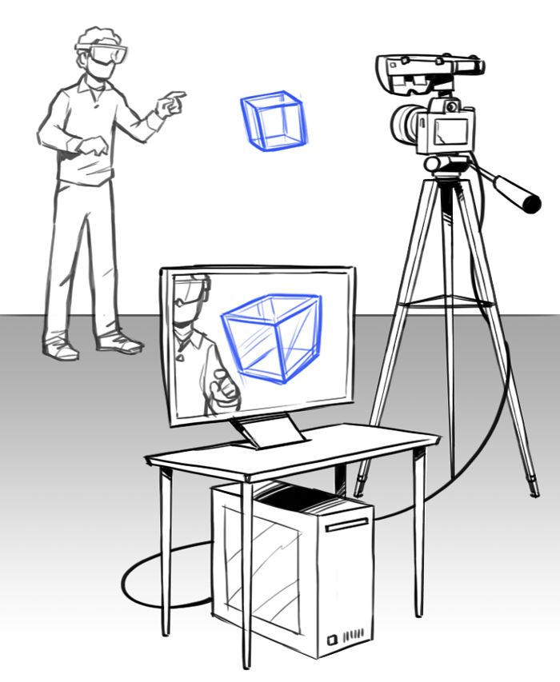
サイズ指定が効かない？のでHTML埋め込みでいいかと思います。
 -->

{width="3.0625in" height="3.7291666666666665in"}

Spectator View のセットアップ

複合現実ヘッドセットを着用していると、第三者が同じ体験をしていないことを忘れがちです。SpectatorView は、HoloLens の利用者が見ている世界を、第三者が 2D 画面で見ることができるようにします。Spectator View を使用するには、以下の 4 つの要素が必要です。

1.  [*ホログラフィック共有エクスペリエンス*](https://developer.microsoft.com/ja-jp/windows/mixed-reality/shared_holographic_experiences#pagenotfound)に基づき、第三者の視点を具体的に実現するためにビルドされたアプリ。
2.  HoloLens を着用し、アプリを使用するユーザー。
3.  第三者の視点でビデオを録画する Spectator View カメラ装置。
4.  共有エクスペリエンス アプリを実行し、ホログラムを Spectator View ビデオに合成するデスクトップ PC。

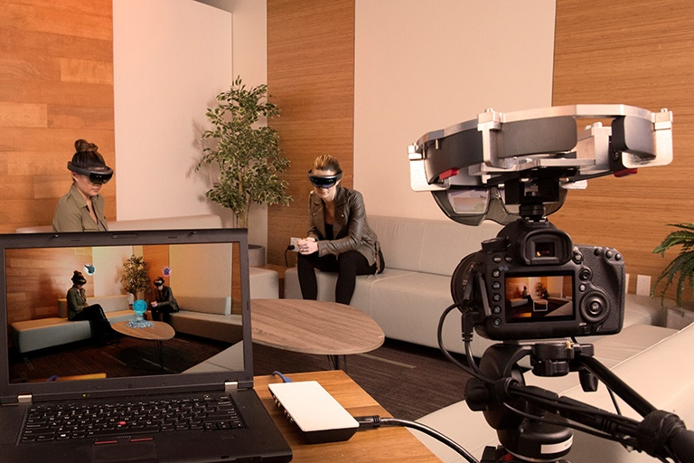{width="5.197916666666667in" height="3.46875in"}

## 本書の内容

-   [1 ユースケース](SpectatorView.md#ユースケース)
-   [2 ビデオキャプチャ技法の比較](SpectatorView.md#ビデオキャプチャ技法の比較)
-   [3 ハードウェア購入リスト](SpectatorView.md#ハードウェア購入リスト)
-   [4 ソフトウェア コンポーネント](SpectatorView.md#ソフトウェア-コンポーネント)
-   [5 独自の Spectator Viewカメラの作成](SpectatorView.md#独自の-spectator-view-カメラの作成)
    -   [5.1 装置の組み立て](SpectatorView.md#装置の組み立て)
    -   [5.2 PCのセットアップ](SpectatorView.md#pc-のセットアップ)
    -   [5.3 カメラのセットアップ](SpectatorView.md#カメラのセットアップ)
-   [6 キャリブレーション](SpectatorView.md#キャリブレーション)
-   [7 コンポジター](SpectatorView.md#コンポジター)
-   [8 Unityアプリ](SpectatorView.md#unity-アプリ)
-   [9 関連項目](SpectatorView.md#関連項目)

## ユースケース

{width="3.6458333333333335in"
height="2.0416666666666665in"}

Spectator View での写真のキャプチャ シナリオの例

{width="3.578472222222222in"
height="2.057638888888889in"}

Spectator View でのビデオのキャプチャ シナリオの例

このテクノロジが適切に機能する重要なシナリオは 3 つあります。

1.  **写真のキャプチャ**

    このテクノロジを使用して、ホログラムの高解像度画像をキャプチャできます。キャプチャした画像は、マーケティングイベントでのコンテンツの展示、見込み顧客への送付、Windows ストアへのアプリケーションの提出などに使用できます。画像をキャプチャするには、高性能デジタル一眼レフカメラなど、写真撮影用のカメラを決めることになります。

2.  **ライブ デモ**

    Spectator View は、カメラの位置を固定または制御できるため、ライブデモに適したアプローチです。高性能ビデオカメラを使用できるため、大画面用の高画質画像も作成できます。画面でのライブデモのストリーミングにも適しているため、順番を待つ参加者が列を成すことでしょう。

3.  **ビデオのキャプチャ**

    ビデオは、ホログラフィックアプリのエクスペリエンスを多くの人々と共有する場合に物語性が最も高い方法です。Spectator View では、アプリの紹介方法に最も適した、カメラ、レンズ、フレームを選ぶことができます。また、使用可能なビデオハードウェアに応じて、ビデオの画質を管理できます。

## ビデオキャプチャ技法の比較

[*複合現実キャプチャ*](https://developer.microsoft.com/ja-jp/windows/holographic/mixed_reality_capture)
(MRC) は、HoloLens 装着者が一人称視点で目にしているものをコンポジットビデオにします。Spectator View は第三者の視点からビデオを生成するため、ビデオを見る人は、ホログラムと HoloLens デバイスを装着しているユーザーが同時に存在する環境を目にすることができます。また、カメラを選択できるため、MRC 画像に使用される HoloLens 組み込みのカメラに比べて、高解像度、高画質の画像を生成できます。そのため、Spectator View は Windows ストアのアプリ画像、マーケティングビデオ、観客向けのライブ ビューイングの投影などに適しています。

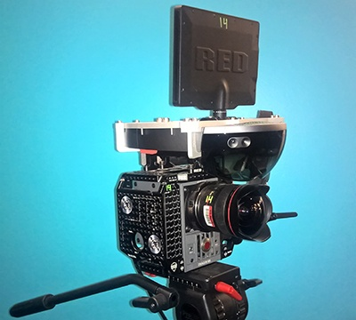{width="3.125in" height="2.8125in"}

Microsoft の基調講演で使用された Spectator View プロフェッショナルカメラ

Microsoft HoloLens が 2015 年 1 月に発表された当初から、Spectator View は、HoloLens
のエクスペリエンスを観客に提示するのに不可欠な要素になっています。Spectator View のプロフェッショナル用設定は、高い価格が設定されていますが、大きな需要があります。たとえば、図のカメラは GenLock 信号を使用して、正確なタイミングで HoloLens のトラッキングシステムと同期を取れるようにしています。このプロフェッショナル用設定では、HoloLens を直接装着している人のエクスペリエンスとホログラムを安定して一致させながら、Spectator View カメラを動かすことできます。

オープンソース版の Spectator Viewでは、設定全体のコストを大きく下げるため、カメラを動かす機能を犠牲にしています。オープンソース プロジェクトでは、HoloLens に固定した外部カメラを使って、ホログラフィック Unity プロジェクトの高解像度画像やビデオを撮影します。**ライブデモの最中は、カメラは動かさず、同じ位置に固定します。** カメラが動くと、ホログラムにぶれやずれが起きる可能性があります。これは、ビデオフレームのタイミングと PC でのホログラムのレンダリングのタイミングが、正確に同期されていないために起こります。そのため、カメラを固定するか、動きを制限することで、HoloLens 装着者が目にしているものに近い映像を生成できます。

アプリを Spectator View対応にするには、[*共有エクスペリエンス*](https://developer.microsoft.com/ja-jp/windows/holographic/holograms_240)アプリをビルドし、そのアプリが HoloLens とデスクトップの Unity エディター内の両方で動作できるようにします。デスクトップ版のアプリには、ビデオフィードとレンダリングされたホログラムを合成する、組み込みの追加コンポーネントを含めます。

## ハードウェア購入リスト

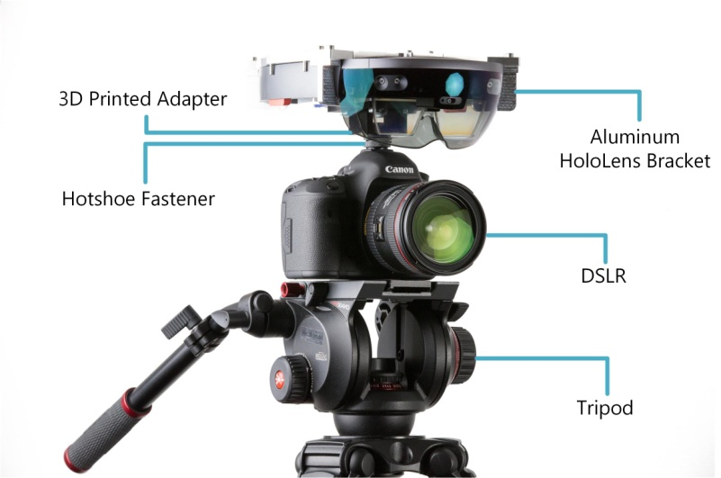{width="3.6458333333333335in"
height="2.4166666666666665in"}

Spectator View 装置

<!-- 下記は表になります。原文を参考にしてください。 -->

以下はハードウェアの推奨リストですが、他の互換装置を試してもかまいません。

  ------------------------------------------------------------------------------------------------------------------------------------------------------------------------------------------------------------------------------------------------------------------------------------------------------------------------------------------------------------------------------------------------------------------------------------------------------------------------------------------------------------------------------------------------------------------------------------------------------------------------------------------------------------------------------------------------------------------------------------------------------------------------------------------------------------------------------------------------------------------------------------------------------------------------------------------------------------------------------------------------------------------------------------------------------------------------------------------------------------------------------------------------------------------------------------------------------------------------------------------------------------------------------------------------------------------------------------------------------------------------------------------------------
  **ハードウェア コンポーネント **                                                                                                                  **推奨**
  ------------------------------------------------------------------------------------------------------------------------------------------------- ----------------------------------------------------------------------------------------------------------------------------------------------------------------------------------------------------------------------------------------------------------------------------------------------------------------------------------------------------------------------------------------------------------------------------------------------------------------------------------------------------------------------------------------------------------------------------------------------------------------------------------------------------------------------------------------------------------------------------------------------------------------------------------------------------------------------------------------------------------------------------------------------------------------------------------------------------------------------------------------------------------------------------------------------------------------------------------------------------------------------------------------------------------------------------------------------------------------------------------------------------
  HoloLens エミュレーターを含み、ホログラフィック開発用に構成した PC。                                                                              

  HDMI 出力端子または写真キャプチャ SDK を備えたカメラ。                                                                                            写真とビデオのキャプチャについては、[*Canon EOS 5D Mark III*](https://www.amazon.co.jp/Canon-%E3%83%87%E3%82%B8%E3%82%BF%E3%83%AB%E4%B8%80%E7%9C%BC%E3%83%AC%E3%83%95%E3%82%AB%E3%83%A1%E3%83%A9-EOS-Mark-EOS5DMK3/dp/B007G3SSP8/ref=sr_1_fkmr0_1?ie=UTF8&qid=1488847621&sr=8-1-fkmr0&keywords=Canon+EOS+5D+Mark+III+22.3+MP+F) カメラが Microsoft によって検証済みです。ライブ デモについては、[*Blackmagic Design の Blackmagic Production Camera 4K*](https://www.amazon.co.jp/Blackmagic-Design-%E3%82%B7%E3%83%8D%E3%83%9E%E3%82%AB%E3%83%A1%E3%83%A9-Production-5%E3%82%A4%E3%83%B3%E3%83%81%E3%82%BF%E3%83%83%E3%83%81%E3%82%B9%E3%82%AF%E3%83%AA%E3%83%BC%E3%83%B3/dp/B00CWLSHYG/ref=sr_1_fkmr0_1?ie=UTF8&qid=148) が Microsoft によって検証済みです。HDMI 出力端子を備えたカメラ (GoPro など) はすべて機能します。Microsoft が公開しているビデオの多くは [*Canon EF 14mm f/2.8L II USM 超広角単焦点レンズ*](https://www.amazon.co.jp/Canon-%E5%8D%98%E7%84%A6%E7%82%B9%E5%BA%83%E8%A7%92%E3%83%AC%E3%83%B3%E3%82%BA-EF14mm-F2-8-%E3%83%95%E3%83%AB%E3%82%B5%E3%82%A4%E3%82%BA%E5%AF%BE%E5%BF%9C/dp/B000V9F3BG/ref=sr_1_1?ie=UTF8&qid=1488847878&sr=8-1&keywords=Canon+EF+14m)を使用していますが、ニーズに合ったレンズを選択してください。

  カメラからカラー フレームを取得して装置のキャリブレーションを行い、合成シーンのプレビューを表示するための PC 用キャプチャ カード。                [*Blackmagic Design の Intensity Pro 4K キャプチャ カード*](https://www.amazon.co.jp/Blackmagic-Design-%E3%82%AD%E3%83%A3%E3%83%97%E3%83%81%E3%83%A3%E3%83%BC%E3%82%AB%E3%83%BC%E3%83%89-Intensity-003062/dp/B00U3QNP7Q/ref=sr_1_1?ie=UTF8&qid=1488848730&sr=8-1&keywords=Intensity+Pro+4K)が Microsoft によって検証済みです。

  ケーブル                                                                                                                                          カメラをキャプチャ カードに取り付けるための [*HDMI からミニ HDMI への変換ケーブル*](https://www.amazon.co.jp/Amazon%E3%83%99%E3%83%BC%E3%82%B7%E3%83%83%E3%82%AF-%E3%83%8F%E3%82%A4%E3%82%B9%E3%83%94%E3%83%BC%E3%83%89HDMI%E3%82%B1%E3%83%BC%E3%83%96%E3%83%AB-0-9m-%E3%82%BF%E3%82%A4%E3%83%97A%E3%82%AA%E3%82%B9-%E3%83%9F%E3%83%8B%E3%82%BF%E3%258)。使用するカメラに合った HDMI フォーム ファクターを購入します (たとえば、GoPro は[*マイクロ HDMI*](https://www.amazon.co.jp/Amazon%E3%83%99%E3%83%BC%E3%82%B7%E3%83%83%E3%82%AF-%E3%83%8F%E3%82%A4%E3%82%B9%E3%83%94%E3%83%BC%E3%83%89HDMI%E3%82%B1%E3%83%BC%E3%83%96%E3%83%AB-1-8m-%E3%82%BF%E3%82%A4%E3%83%97A%E3%82%AA%E3%82%B9-%E3%83%9E%E3%82%A4%E3%82%AF%E3%258) 経由で出力します)。\
                                                                                                                                                    プレビュー用モニターまたはテレビで合成フィードを表示するための [*HDMI ケーブル*](https://www.amazon.co.jp/Amazon%E3%83%99%E3%83%BC%E3%82%B7%E3%83%83%E3%82%AF-%E3%83%8F%E3%82%A4%E3%82%B9%E3%83%94%E3%83%BC%E3%83%89HDMI%E3%82%B1%E3%83%BC%E3%83%96%E3%83%AB-%E3%82%BF%E3%82%A4%E3%83%97A%E3%82%AA%E3%82%B9-%E3%82%AA%E3%83%BC%E3%83%87%E3%82%A3%25)。

  HoloLens と カメラをつなぐ、機械加工済みアルミニウム製ブラケット (取り付け金具)。詳細については、OSS プロジェクトの README を参照してください。   

  HoloLens のマウント部とカメラのホットシューをつなぐ、3D プリンター製アダプター。詳細については、OSS プロジェクトの README を参照してください。    

  ホットシュー アダプターを取り付ける雲台 (ホットシュー ファスナー)。                                                                               [*雲台*](https://www.amazon.co.jp/Adapter-Cleaning-Photography-Accessories-INC/dp/B010EIQANS/ref=sr_1_1?ie=UTF8&qid=1488850568&sr=8-1&keywords=Fotasy+SCX2+1%2F4-Inch+20+Tripod+Screw)

  各種ナット、ボルト、工具。                                                                                                                        [*1/4-20 インチのナット*](https://www.amazon.co.jp/Hillman-Group-150003-20-Inch-100-Pack/dp/B014S9NSE8/ref=sr_1_1?ie=UTF8&qid=1488851007&sr=8-1&keywords=Hillman+Group+150003+Finish)\
                                                                                                                                                    [*1/4-20 x 3/4 インチのボルト*](https://www.amazon.co.jp/Hillman-Group-4-20-Inch-100-Pack/dp/B014S9NSE8/ref=sr_1_1?ie=UTF8&qid=1488851007&sr=8-1&keywords=Hillman+Group+150003+Finish)\
                                                                                                                                                    [*7/16 インチのナット ドライバー*](https://www.amazon.co.jp/Klein-Tools630-7-Driver-7-16-DRIVER/dp/B000BPG4CW/ref=sr_1_2?ie=UTF8&qid=1488851359&sr=8-2&keywords=Klein+Tools+630-7%2F16+7%2F16-Inch)\
                                                                                                                                                    [*T15 トルクス ドライバー*](https://www.amazon.co.jp/Stanley60-011Torx-Basic-Screwdriver-T15-TORX-SCREWDRIVER/dp/B000KFXDWW/ref=sr_1_fkmr0_1?ie=UTF8&qid=1488851404&sr=8-1-fkmr0&keywords=Stanley+60-011+T15+Standard+Torx+Screwdriver)\
                                                                                                                                                    [*T7 トルクス ドライバー*](https://www.amazon.co.jp/SE-7542ST-6-Piece-Deluxe-Storage/dp/B015RE8TE2/ref=sr_1_fkmr0_1?ie=UTF8&qid=1488851457&sr=8-1-fkmr0&keywords=SE+7542ST+6-Piece+Professional+Torx+Screwdriver)
  ------------------------------------------------------------------------------------------------------------------------------------------------------------------------------------------------------------------------------------------------------------------------------------------------------------------------------------------------------------------------------------------------------------------------------------------------------------------------------------------------------------------------------------------------------------------------------------------------------------------------------------------------------------------------------------------------------------------------------------------------------------------------------------------------------------------------------------------------------------------------------------------------------------------------------------------------------------------------------------------------------------------------------------------------------------------------------------------------------------------------------------------------------------------------------------------------------------------------------------------------------------------------------------------------------------------------------------------------------------------------------------------------------

## ソフトウェア コンポーネント

1.  [*Spectator View の GitHub プロジェクト*](https://github.com/Microsoft/HoloLensCompanionKit/tree/master/SpectatorView)からダウンロードしたソフトウェア。

2.  [*Blackmagic のキャプチャカード用 SDK*](https://www.blackmagicdesign.com/jp/support)。\[最新のダウンロード情報\] から、「Desktop Video のデベロッパー SDK」を探します。

3.  [*Blackmagic Desktop Videoのランタイム*](https://www.blackmagicdesign.com/jp/support)。\[最新のダウンロード情報\] から、「Desktop Video のソフトウェアアップデート」を探します。\ バージョン番号が SDK のバージョンと一致していることを確認します。

4.  [*OpenCV 3.1*](http://opencv.org/downloads.html)。Blackmagic のキャプチャ カードなしでキャリブレーションまたはビデオのキャプチャを行う場合。

5.  [*Canon のSDK*](https://www.usa.canon.com/internet/portal/us/home/explore/solutions-services/digital-camera-sdk-information) (オプション)。Canon のカメラを使用し、Canon の SDK にアクセスできる場合、カメラを PC に接続して高解像度画像を撮影できます。

6.  ホログラフィック アプリ開発用の Unity。サポート対象のバージョンは、オープン ソースプロジェクトで確認できます。

7.  最新の更新プログラムを適用した Visual Studio 2015。

## 独自の Spectator View カメラの作成

**通知および免責事項:** HoloLens ハードウェアに変更を加える場合( " Spectator View " 向けに HoloLens をセットアップすることを含みますが、これに限定されません)、常に基本的な安全措置を講じなければなりません。あらゆる変更を加える前に、すべての指示書および取扱説明書をお読みください。自己責任において、すべての指示に従い、指示どおりに工具をお使いください。購入またはライセンスが許可される HoloLens には、品質保証規定付きのもの、または無保証のものがあります。保証のオプションについては、適用される[*HoloLens使用許諾契約書または使用販売条件*](http://microsoft.com/microsoft-hololens/ja-jp/order-now)をお読みください。

### 装置の組み立て

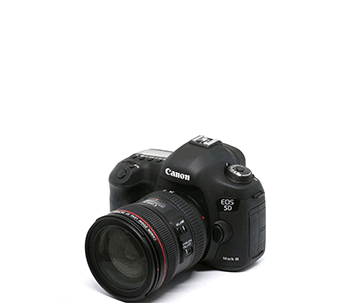{width="3.578472222222222in"
height="3.1618055555555555in"}

HoloLens と DSLR カメラを使って組み立てた Spectator View 装置。

-   T7 ドライバーを使って、HoloLensからヘッドバンドを取り外します。ネジが緩んだら、クリップを使って反対側から押し出します。
-   HoloLens バイザー前面内側にあるネジぶたを、小型皿ネジドライバーで取り外します。
-   T15 ドライバーを使って、HoloLens のブラケットから小さなトルクスボルトを取り外し、U 字留め具とフック型留め具を取り外します。
-   ブラケットの上に HoloLens を置き、バイザー内部に露出した穴と、ブラケット正面の突起の位置を揃えます。HoloLens のアームを、ブラケットのにあるピンで定位置に固定します。
-   U 字留め具とフック型留め具を再度取り付け、ブラケットに HoloLens をしっかりと固定します。
-   雲台をカメラのホットシューに取り付けます。
-   マウント アダプターを雲台に取り付けます。
-   アダプターの狭い面が前を向き、カメラのレンズと平行になるようにアダプターを回転します。
-   7/16 ナット ドライバーを使って、1/4 インチナットでアダプターを定位置にしっかりと固定します。
-   HoloLens のバイザーの前面がカメラのレンズ正面にできるだけ近づくように、アダプターの反対側にブラケットの位置を決めます。
-   7/16 ナット ドライバーを使って、1/4 インチ ナットとボルト 4 つでブラケットを取り付けます。

### PC のセットアップ

-   前述の「ソフトウェアコンポーネント」で示したソフトウェアをインストールします。
-   マザーボード上の空き PCIe スロットにキャプチャカードを差し込みます。
-   キャプチャ カードの外側の HDMI スロット (HDMI 入力) にカメラからの HDMI ケーブルを接続します。
-   オプションのプレビュー用モニターにキャプチャ カードの中央の HDMI スロット (HDMI 出力) からの HDMI ケーブルを接続します。

### カメラのセットアップ

-   カメラをビデオ モードに切り替えて、3:4 のトリミング写真解像度ではなく、1920 x 1080 のフル解像度で出力します。
-   カメラの HDMI 設定で、「ミラーリング」または「デュアルモニター」を有効にします。
-   出力解像度を 1080 ピクセルに設定します。
-   「ライブビュー画面表示」をオフにして、合成フィードに画面のオーバーレイが現れないようにします。
-   カメラの「ライブ ビュー」をオンにします。
-   Canon SDK を使用していて、フラッシュを使う場合は、「ライブビューの静音撮影」を無効にします。
-   キャプチャ カードの外側の HDMI スロット (HDMI 入力) にカメラからの HDMI ケーブルを接続します。

## キャリブレーション

Spectator View の装置を設定後、カメラから HoloLens までの位置と回転のオフセットを取得するために、キャリブレーションを行う必要があります。

-   Calibration フォルダーにあるキャリブレーション用の Visual Studio ソリューション (Calibration.sln) を開きます。
-   このソリューションにはファイル (dependencies.props)があります。このファイルは、サードパーティ製ソースのインクルードファイルの位置情報に関するマクロを作成します。
-   このファイルを更新して、OpenCV 3.1、Blackmagic SDK、および Canon SDK (該当する場合) をインストールした場所を設定します。

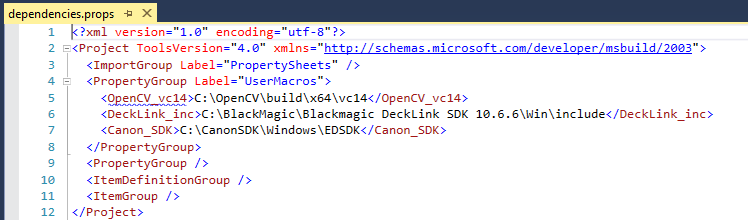{width="6.245138888888889in" height="1.8125in"}

-   フラットな固定面のキャリブレーションパターン (Calibration\\CalibrationPatterns\\2\_66\_grid\_FULL.png)を印刷します。
-   HoloLens と PC を USB 接続します。
-   stdafx.h にあるプリプロセッサ定義 HOLOLENS\_USER と HOLOLENS\_PW を、HoloLens Device Portal の資格情報に更新します。
-   HDMI 経由でカメラとキャプチャカードを接続し、カメラのスイッチをオンにします。
-   キャリブレーション ソリューションを実行します。
-   添付の動画のように、ビュー全体に格子縞パターンを動かします。

> 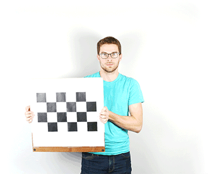{width="3.578472222222222in" height="3.0in"}
>
> Spectator View 装置のキャリブレーション

-   格子縞がビュー内に入ると、写真が自動的に撮影されます。次の姿勢に移る前に、HoloLens のバイザーでの白色光を探します。
-   完了したら、Calibration アプリで **Enter** キーを押して CalibrationData.txt ファイルを作成します。
-   保存先のファイルは Documents\\CalibrationFiles\\CalibrationData.txt です。
-   このファイルを調べ、キャリブレーションデータが正確かどうかを以下のように確認します。
    -   **DSLR RMS** が 0 に近い値であること。
    -   **HoloLens RMS** が 0 に近い値であること。
    -   **Stereo RMS** の値が20 ～ 50 の範囲内であること。これは、2 台のカメラ間で視野が異なる可能性があるためです。
    -   **Translation** は、HoloLens のカメラのレンズと取り付けたカメラのレンズの距離 (メートル単位)
        です。
    -   **Rotation** はほぼ同じになること。
    -   **DSLR\_fov** の値 y は、レンズの焦点距離とカメラ本体のクロップファクターから予想される垂直視野に近い値であること。
-   上記の値のいずれかが適正でなければ、再度キャリブレーションを行います。
-   このファイルを Unity プロジェクトの **Assets** ディレクトリにコピーします。

## コンポジター

コンポジターは Unity の拡張機能で、Unity エディターのウィンドウとして動作します。この機能を有効にするには、まず、コンポジターの Visual Studio ソリューションをビルドします。

-   Compositor フォルダーにあるコンポジターの Visual Studio ソリューション (Compositor.sln) を開きます。
-   前述のキャリブレーションソリューションと同じように、ファイル (dependencies.props)を更新します。キャリブレーションの手順を行った場合、このファイルは更新済みです。
-   \[Release\] モードと、Unity バージョンのアーキテクチャと同じアーキテクチャを指定して、ソリューション全体をビルドします。アーキテクチャが分からない場合は、\[x86\] と \[x64\] でそれぞれビルドします。
-   \[x64\] アーキテクチャでソリューションをビルドする場合、HoloLens で動作する SpatialPerceptionHelper プロジェクトは \[x86\] でビルドします。
-   Unity でアプリを実行している場合は、Unity を終了します。実行時に DLL が変わる場合は、Unity を再起動する必要があります。
-   Compositor フォルダーにある CopyDLL.cmd を実行し、このソリューションでビルドした DLL を Unity
    プロジェクトにコピーします。このスクリプトは、付属のサンプルプロジェクトに DLL をコピーします。自身のプロジェクトをセットアップしたら、プロジェクトの Assets ディレクトリを指すコマンド ライン引数を指定して CopyDLL を実行し、このディレクトリにも DLL をコピーします。
-   Unity サンプル アプリを起動します。

## Unity アプリ

コンポジターは、Unity エディターのウィンドウとして動作します。付属のサンプルプロジェクトにより、コンポジターの DLL をコピーするだけで、Spectator View で機能するようにすべての要素がセットアップされます。

Spectator View には、[*共有エクスペリエンス*](https://developer.microsoft.com/ja-jp/windows/holographic/holograms_240)として動作するアプリが必要です。つまり、HoloLens で起こるアプリの状態変化を、ネットワークに接続する Unity アプリにも送ってその状態を更新する必要があります。

新しく Unity プロジェクトを作成する場合は、最初にいくつかセットアップが必要になります。

-   サンプル プロジェクトの Assets/Addons/HolographicCameraRig を、新しく作成するプロジェクトにコピーします。
-   Sharing、csc.rsp、gmcs.rsp、smcs.rsp など、最新の HoloToolkit をプロジェクトに追加します。
-   CalibrationData.txt ファイルを、Assets ディレクトリに追加します。

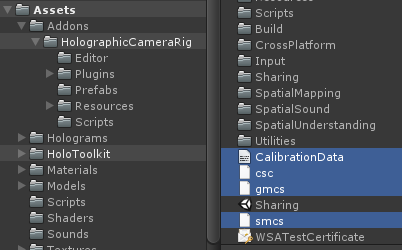{width="4.145833333333333in"
height="2.5833333333333335in"}

-   HolographicCameraRig\\Prefabs\\SpectatorViewManager をシーンに追加して、以下のようにフィールドを設定します。
    -   \[Holographic Camera Manager\] (ホログラフィックカメラ マネージャー) フィールドには、HolographicCameraRig ディレクトリの HolographicCameraManager を設定します。
    -   \[Anchor\] (アンカー) フィールドには、HolographicCameraRig ディレクトリの Anchor を設定します。
    -   \[Sharing\] (共有) フィールドには、HoloToolkit の Sharing を設定します。
    -   メモ:ここで指定しているオブジェクトのいずれかがプロジェクト階層に既に存在している場合、上記の代わりに既存のオブジェクトが使用されます。
    -   \[Spectator View IP\] (Spectator View の IP)フィールドには、Spectator View 装置に取り付けた HoloLens の IP を設定します。
    -   \[Sharing Service IP\] (共有サービスの IP)フィールドには、HoloToolkit SharingService を実行している PC の IP を設定します。
    -   オプション: 複数の Spectator View 装置を複数の PC と接続している場合、\[Local Computer IP\] (ローカル
        コンピューターの IP) フィールドに、各 Spectator View 装置が通信する PC の IP を設定します。

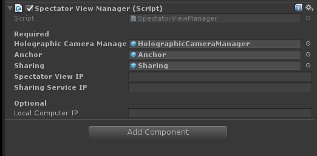{width="5.166666666666667in"
height="2.5208333333333335in"}

-   HoloToolkit SharingService を開始します。
-   アプリを D3D UWP としてビルドして、Spectator View 装置に取り付けた HoloLens に配置します。
-   同じのアプリを、共有エクスペリエンスに参加するすべての HoloLens デバイスに配置します。
-   \[Edit\] (編集)、\[Project settings\] (プロジェクト設定)、\[Player\] (プレイヤー) の順に移動し、\[Run In Background\] (バックグラウンドで実行) チェックボックスをオンにします。

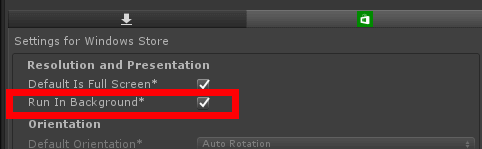{width="4.166666666666667in"
height="1.2916666666666667in"}

-   \[Spectator View\]、\[Compositor\] (コンポジター) の順に移動し、\[Compositor\] (コンポジター) ウィンドウを起動します。

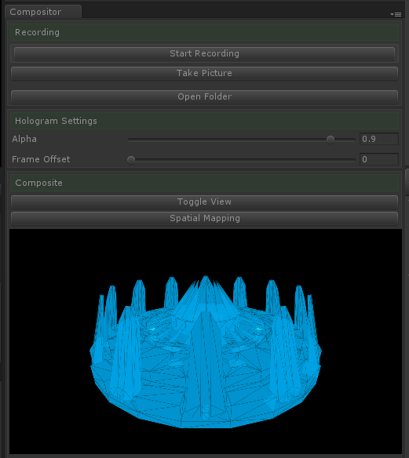{width="5.1618055555555555in" height="5.78125in"}

-   このウィンドウでは、以下のことが可能です。

    -   ビデオの録画を開始する
    -   写真を撮影する
    -   ホログラムの不透明度を変更する
    -   フレーム オフセットを変更する(キャプチャ カードの遅延を考慮するため、色のタイムスタンプを調整する)
    -   撮影した画像や映像が保存されるディレクトリを開く
    -   Spectator View カメラから空間マッピング データを要求する(SpatialMappingManager がプロジェクトに存在する場合)
    -   シーンの合成ビューや、色、ホログラム、アルファチャンネルなどを個々に表示する

<!-- -->

-   カメラのスイッチをオンにします。
-   Unity で \[Play\] (プレイ) をクリックします。
-   カメラが動くと、Unity 内のホログラムが現実世界に現れ、カメラのカラーフィードと相対位置に表示されます。

## 関連項目

-   [*複合現実キャプチャ*](https://developer.microsoft.com/ja-jp/windows/holographic/mixed_reality_capture)
-   [*開発者向け複合現実キャプチャ*](https://developer.microsoft.com/ja-jp/windows/holographic/mixed_reality_capture_for_developers)
-   [*ホログラフィック共有エクスペリエンス*](https://developer.microsoft.com/ja-jp/windows/holographic/shared_holographic_experiences)
-   [*ホログラム240*](https://developer.microsoft.com/ja-jp/windows/holographic/holograms_240)
-   [*GitHub の Spectator Viewコード*](https://github.com/Microsoft/HoloLensCompanionKit/tree/master/SpectatorView)
